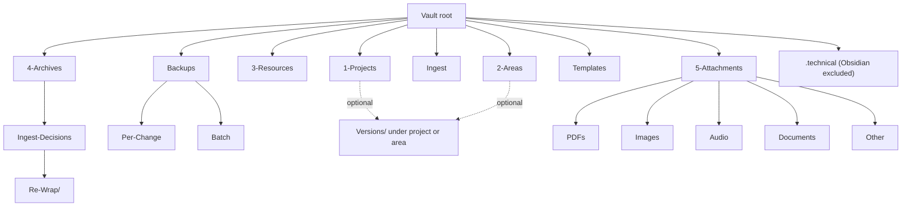
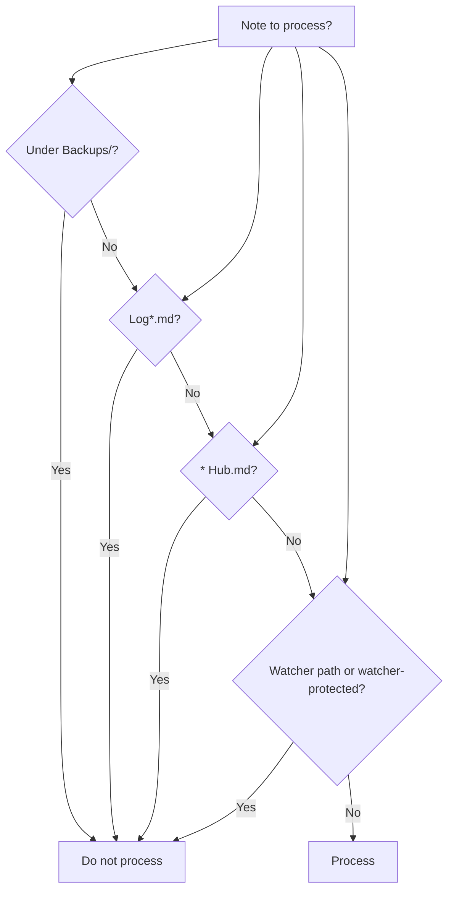

**TL;DR** — PARA-only roots (1-Projects, 2-Areas, 3-Resources, 4-Archives), Ingest, Backups, Templates, 5-Attachments, .technical. Never use 00 Inbox, 10 Zettelkasten, 99 Attachments, 99 Templates. Use Quick Reference table and protected paths; exclusions in mcp-obsidian-integration.

---

## Quick Reference — Folder roles

| Folder | Purpose |
|--------|---------|
| **1-Projects** | Time-bound projects; subfolders ≤4 levels |
| **2-Areas** | Ongoing areas |
| **3-Resources** | Evergreen reference; logs, Second-Brain docs |
| **4-Archives** | Inactive; applied wrappers under 4-Archives/Ingest-Decisions |
| **Ingest** | All new files; Decision Wrappers under Ingest/Decisions/** |
| **Backups/Per-Change**, **Backups/Batch** | Snapshots; append-only; never pipeline input |
| **.technical** | prompt-queue.jsonl, machine-only; excluded from Obsidian |

---

## Safety — Protected paths

> [!warning] **Never move/delete**: `Backups/**`, `3-Resources/Watcher-Signal.md`, `3-Resources/Watcher-Result.md`, `Ingest/watched-file.md`, notes with `watcher-protected: true`. Pipelines must not process Decision Wrappers under `Ingest/Decisions/**` as primary inputs.

---

## Folder names never to use (blacklist)

**Do not use or reference:** `00 Inbox`, `10 Zettelkasten`, `99 Attachments`, `99 Templates`. Use only the canonical names: **Ingest** (not 00 Inbox), **Templates** (not 99 Templates), **5-Attachments** or **Attach** (not 99 Attachments). There is no Zettelkasten root — use PARA roots and subfolders only. See [[.cursor/rules/always/mcp-obsidian-integration|mcp-obsidian-integration]].

## Folder structure

| Folder | Purpose | Responsibilities |
|--------|---------|------------------|
| **1-Projects** | Time-bound projects; project-id + themes; subfolders ≤4 levels | Agent moves here from Ingest when para-type=Project; subfolders from project-id + themes |
| **2-Areas** | Ongoing areas of responsibility | Agent moves here when para-type=Area |
| **3-Resources** | Evergreen reference; hubs, config, logs, Second-Brain docs | Hubs, config notes, pipeline logs, Second-Brain docs; agent moves here when para-type=Resource |
| **4-Archives** | Inactive or completed; archive path from project-id + themes | Agent moves completed notes here via autonomous-archive; never re-processed by pipelines |
| **4-Archives/Ingest-Decisions** | Applied Decision Wrappers (moved after apply-mode) | Processed wrappers from `Ingest/Decisions/**`; subfolders mirror live structure (Ingest-Decisions/, Roadmap-Decisions/, Refinements/, Low-Confidence/, Errors/, Re-Wrap/…). Kept for training/history; never auto-deleted; step 0 only scans `Ingest/Decisions/**` so this folder tree is not re-scanned. |
| **4-Archives/Ingest-Decisions/Re-Wrap/** | Archived wrappers from re-wrap flow | When user sets `re-wrap: true` or `approved_option: 0`, EAT-QUEUE archives the current wrapper here (e.g. `Re-Wrap/Ingest-Decisions/`, `Re-Wrap/Roadmap-Decisions/`) before creating a new wrapper with Thoughts as seed. Subfolders mirror live structure; never auto-deleted. See auto-eat-queue re-wrap branch. |
| **Ingest** | All new/unknown files arrive here; processed by full-autonomous-ingest | All new/unknown files land here; agent processes then moves out to PARA. Mid/low-confidence or ambiguous cases create Decision Wrappers under `Ingest/Decisions/**` (e.g. `Ingest-Decisions/`, `Refinements/`, `Low-Confidence/`, `Errors/`) that coordinate user-approved moves via EAT-QUEUE. See [[3-Resources/Second-Brain/Vault-Layout#Ingest/Decisions subfolders]]. Stale wrappers (processed but still in Decisions): EAT-QUEUE tries ingest if original still in Ingest; else archives wrapper only when original is at target; otherwise tags Orphan/True Orphan and adds internal note (no archive). |
| **Ingest/Agent-Output/** | Drop zone for Cursor (Composer/cloud) agent output | Notes here or with frontmatter `agent-generated: true` (and optionally `confidence_override: high`) may skip the Decision Wrapper and be moved in Phase 1 when conditions in para-zettel-autopilot are met. See [[3-Resources/Second-Brain/Cursor-Agent-Ingest-Workflow]]. Per docs, `Ingest/**` is processed by the ingest pipeline; add to .cursorignore or Watcher exclusions only if needed. |
| **Ingest/Agent-Research/** | Synthesized research output from research-agent | Query → fetch → synthesize; same processing as other Ingest (full-autonomous-ingest, then optional DISTILL/EXPRESS). **Research synthesis notes may ingest without a Decision Wrapper** when the same conditions as agent-output hold (ingest_conf ≥85%, single clear target, not FORCE-WRAPPER; see ingest rule § Cursor-agent direct move). Frontmatter on created notes: `research_query`, `linked_phase`, `project_id`, `agent-generated: true`, `research_tools_used` (array; e.g. `semantic_scholar`, `arxiv`, `crossref`, `web_search`, `firecrawl`, `browser_mcp`, `mcp_web_fetch`; legacy values `web`, `browse`, `freecrawl` remain valid for reads), plus standard `created`, `tags`, `para-type` after classification. Not in pipeline exclusions; Ingest-Log may include `#cursor-agent-direct`-style lines for research notes when moved with high confidence. See [[3-Resources/Second-Brain/Logs]]. Only **synthesis** notes here are queued for INGEST_MODE/DISTILL; raw notes in Raw/ are not. |
| **Ingest/Agent-Research/Raw/** | Raw scraped content per research run (vault-first) | One note per run with sections `## Source: <url>` containing the extracted content that fed synthesis. Used for traceability (check synthesis against actual content) and vault-first deduplication (same URL not re-fetched). Not processed by ingest pipeline as PARA content; notes stay as reference material. Frontmatter: `source_urls`, `linked_phase`, `project_id`, `created`, `tags: [research, agent-research, raw]`, `agent-generated: true`. |
| **Ingest/Agent-Research/Raw/Raw-Index.md** | Index mapping URL → path for vault-first lookup | Markdown table `| url | path | date |`; research-agent-run reads it in Step 0b and appends rows when writing new raw notes. Append-only; same URL normalizer used when reading and writing. See research-agent-run skill § Raw index format. |
| **Backups/Per-Change** | In-vault per-change snapshots; append-only | Agent writes per-change snapshots here; never process as pipeline input |
| **Backups/Batch** | In-vault batch checkpoint notes | Agent writes batch checkpoint notes here; append-only |
| **Versions/** (under note parent) | Version snapshots (express pipeline) | version-snapshot skill writes dated copies under the note’s parent (e.g. `1-Projects/Project-X/Versions/`); not under Backups/ |
| **Templates** | Note templates (Ingest-template, AI-Output, etc.) | Used for new notes; pipelines do not process Templates/ as input |
| **5-Attachments/PDFs** | PDFs (and other subtypes: Images, Audio, Documents, Other) | User moves binaries here; companion .md may reference via `![[5-Attachments/...]]` |
| **.technical** | Cursor/Watcher machine-only bin (queue, signals, timing log, setup logs) | Chosen: .technical for auto-hidden behavior in Obsidian; visible in Cursor. Excluded via Settings → Excluded files. Contains: `prompt-queue.jsonl`, **`queue-continuation.jsonl`** (append-only continuation snapshots per [[3-Resources/Second-Brain/Docs/Queue-Continuation-Spec|Queue-Continuation-Spec]]), **`task-handoff-comms.jsonl`** (append-only Cursor `Task` hand-off/return transcript per [[3-Resources/Second-Brain/Docs/Task-Handoff-Comms-Spec|Task-Handoff-Comms-Spec]]; may also include **`intent_snapshot`** / **`intent_actual_receipt`** rows per [[3-Resources/Second-Brain/Queue-Sources|Queue-Sources]] § Parallel execution tracking), optional **`Task-Comms-Overflow/`** for oversized bodies, `Watcher-Timing-Log.md`; **parallel lanes:** **`.technical/parallel/<track>/`** holds per-lane **PQ**, audit, continuation, comms (same inner filenames). Watcher-Signal/Result stay in 3-Resources unless plugin paths updated (Option A). Never place human-authored notes here. Task-Queue.md body format and Plan-mode append rules: see [[3-Resources/Second-Brain/Queue-Sources|Queue-Sources]]. See [[3-Resources/Clean-technical-folder|Clean-technical-folder]]. |
| **.technical/Run-Telemetry/** | Run telemetry (primary + subagents) | One note per run; **YAML frontmatter required**; **body** may include human-readable sections (e.g. Roadmap: **`## Nested subagent ledger`** with Summary, ordered steps, Raw YAML per [[3-Resources/Second-Brain/Docs/Nested-Subagent-Ledger-Spec|Nested-Subagent-Ledger-Spec]]). Naming: `Run-YYYYMMDD-HHMMSS-<project_id>-<actor>.md`. Agent-written; Dataview-queried from [[3-Resources/Telemetry-Dashboard|Telemetry-Dashboard]]. If Obsidian excludes .technical, ensure Run-Telemetry is visible to Dataview or document the exception. See [[3-Resources/Second-Brain/Logs#Run-Telemetry|Logs § Run-Telemetry]] and Parameters § Run-Telemetry. Watcher **`trace`** may truncate large ledgers and link here. |

**Per-project telemetry view:** To view telemetry for a single project, add a note at `1-Projects/<project_id>/Roadmap/Telemetry.md` with frontmatter `project_id: <project_id>` and a Dataview block: `FROM ".technical/Run-Telemetry" WHERE project_id = this.project_id SORT file.mtime DESC` (columns: actor, success, util_pct, total_tokens, cost_estimate_usd when present, file.mtime). Alternatively, embed in **workflow_state.md** a section "## Run telemetry (this project)" with the same query using `WHERE project_id = split(this.file.folder, "/")[1]` so project_id is derived from the file path. Global view remains [[3-Resources/Telemetry-Dashboard|Telemetry-Dashboard]].

## Root-level technical files (must stay at root)

These **belong conceptually to the technical setup** but **must stay at vault root** because the tools that use them read them there:

| File | Purpose | Why at root |
|------|---------|-------------|
| **.cursorignore** | Excludes paths from Cursor indexing and AI context (e.g. `.technical/`, `*.jsonl`, `Watcher-*.md`) | Cursor reads it from project root only |
| **.stignore** | Syncthing ignore patterns (like .gitignore for sync) | Syncthing reads it from the shared folder root only |
| **.obsidianignore** | Optional; some plugins use it for exclusion (Obsidian has no built-in support) | If present, plugins may expect it at vault root |

**Hub notes** (e.g. Resources Hub.md, Projects Hub.md, Areas Hub.md) stay in the vault root or 3-Resources — they are content and are linked from many notes; moving them would break links. They are excluded from pipeline processing via the `* Hub.md` rule but are not “technical” in the same sense as the ignore/config files above.

## Ingest/Decisions subfolders

Step 0 (EAT-QUEUE) enumerates all markdown under `Ingest/Decisions/` recursively. Processed wrappers are moved to `4-Archives/Ingest-Decisions/` with **subfolders mirroring the live structure** so archive stays organized.

| Live subfolder | Purpose | Archive mirror |
|----------------|---------|----------------|
| **Ingest-Decisions/** | Ingest Phase 1 path/relocation decisions (A–G) | `4-Archives/Ingest-Decisions/Ingest-Decisions/` |
| **Roadmap-Decisions/** | Roadmap seed decisions (Option A = new project + roadmap tree) | `4-Archives/Ingest-Decisions/Roadmap-Decisions/` |
| **Refinements/** | Mid-band (68–84%) refinement wrappers; FORCE-WRAPPER | `4-Archives/Ingest-Decisions/Refinements/` |
| **Low-Confidence/** | Low-confidence (<68%) proposals | `4-Archives/Ingest-Decisions/Low-Confidence/` |
| **Errors/** | Safety-gate / error recovery wrappers (link to Errors.md) | `4-Archives/Ingest-Decisions/Errors/` |

**Archive path rule**: When moving a processed wrapper to archive, derive the target from the wrapper's current path: replace prefix `Ingest/Decisions/` with `4-Archives/Ingest-Decisions/` (e.g. `Ingest/Decisions/Refinements/Decision-for-x.md` → `4-Archives/Ingest-Decisions/Refinements/Decision-for-x.md`). Re-Wrap flow continues to use `4-Archives/Ingest-Decisions/Re-Wrap/Ingest-Decisions/` (or Roadmap-Decisions) when archiving before creating a new wrapper.

## Roadmap state artifacts (multi-run)

Under **`1-Projects/<project-id>/Roadmap/`** the multi-run roadmap pipeline uses these artifacts (created on first run when not in one-shot mode; see Multi-Run Roadmap plan and multi-run default plan). **Multi-run is the only supported mode;** one-shot is deprecated (ROADMAP-ONE-SHOT).

**Template-backed initialization:** When a roadmap run needs to create any missing artifact for the first time, it instantiates it from `Templates/Roadmap/Artifacts/*` (canonical templates). Existing artifacts are never overwritten by templates; templates only apply to “create when missing” bootstraps. The schema below remains the authoritative spec.

| Artifact | Purpose |
|----------|---------|
| **roadmap-state.md** | Single source of truth for run progress. **Schema (enforced):** frontmatter must include `current_phase` (int), `status` (generating \| complete \| blocked \| recal-needed), `version` (int; increment on every write), `last_run` (YYYY-MM-DD-HHMM), `completed_phases` (array e.g. [1,2,3]), `drift_score_last_recal` (float 0.0–1.0; higher = more drift), **`handoff_drift_last_recal`** (float 0.0–1.0; parallel to drift_score; RECAL-ROAD sums both; if handoff_drift > 0.2, force hand-off audit). Body: phase summaries, consistency report callout when RECAL-ROAD has run. **Snapshot before and after every update** (per mcp-obsidian-integration § Roadmap state invariants). Never advance current_phase unless all prior phases have conf ≥ 85%. |
| **decisions-log.md** | Bullet list of key choices per phase; appended by pipeline (e.g. "- Phase N: [summary] [[phase-n-output]] (conf X%)"). Hand-off-audit appends lines with `#handoff-review`, `#handoff-needed`. |
| **handoff-validation-report-&lt;date&gt;.md** | Output of **Validator subagent** (queue mode ROADMAP_HANDOFF_VALIDATE): one report per run with summary, per-phase findings, cross-phase issues. Path: `1-Projects/<project_id>/Roadmap/handoff-validation-report-<date>.md` (e.g. `handoff-validation-report-2026-03-15-HHMM.md`). Date in filename allows multiple runs. Validator is read-only on all other artifacts; only this file is created. |
| **distilled-core.md** | Compressed memory for resumption: frontmatter `core_decisions`, body Mermaid dependency graph. Built from phase outputs after distill; 🔵 core decisions appended per phase. |
| **phase-X-output.md** | Approach A: dedicated narrative dump per phase when content exceeds ~1k tokens; canonical source is the phase roadmap note. Kept in sync by **phase output sync** rule; single writer (pipeline only). |
| **workflow_state.md** | Run-time automation state for Cursor Agent loop (Option B): frontmatter `current_phase`, `current_subphase_index`, `status` (in-progress \| blocked), `automation_level` (semi), `last_auto_iteration`, `iterations_per_phase` (object), optional `max_iterations_per_phase` (hard ceiling; default **80**; dial to 15–20 when drift recurs), optional `max_iterations_total`, optional **`iteration_guidance_ranges`**, optional **`above_guidance`**; optional **`deepen_log`**; optional **`chained_branch_count`** (int, default 0; increment when branch-expand queued, reset on RECAL or phase advance; cap 2 per phase); optional **`last_injected_tokens`**, **`last_util_pct`** (when inject_extra_state used); **`last_ctx_util_pct`** (Ctx Util % from last Log row; written by roadmap-deepen after each append so auto-roadmap can read util without parsing the table and combine it with **`current_depth`** (derived from `current_subphase_index` as `1 + count('.')`) for depth-aware research gating); optional **`last_conf`** (Confidence 0–100 from last Log row; used by auto-roadmap for research quality veto); optional **`injected_research_paths`** (when RESEARCH-AGENT completes async, persist here keyed by project+phase so next RESUME-ROADMAP can "resume from last injected" if queue batch failed). Body = **## Log** with an append-only table containing one row per deepen/roadmap iteration. The **canonical** log is the **first** `## Log` table in the file (the one that immediately follows the first YAML frontmatter block). All appends and "last data row" parsing use only this table; the file should contain only one frontmatter and one ## Log section (duplicate sections are legacy; remove in a one-time cleanup). Legacy logs use an **11-column** schema; the **12-column** canonical schema adds **Confidence**: **Timestamp \| Action \| Target \| Iter Obj \| Iter Phase \| Ctx Util % \| Leftover % \| Threshold \| Est. Tokens / Window \| Util Delta % \| Confidence \| Status / Next**. Newer runs are encouraged to extend this to a **single, richer row** that adds **Start Local**, **Completion Local**, and **Duration sec** fields (local timestamps and elapsed seconds for the iteration) alongside the existing context columns. Status / Next may include gaps summary (e.g. `gaps: 2 (examples, pseudocode)`) or **advisory** text (e.g. `advisory: diminishing-returns-suspected`). Created in Phase 0 by roadmap-generate-from-outline when missing. See **workflow_state ## Log table format** below. |
| **roadmap-state.md (dual-track)** | **Recommended:** set frontmatter **`roadmap_track`**: `conceptual` \| `execution` explicitly (template default `conceptual`). When **absent**, consumers treat as **`conceptual`** per [[3-Resources/Second-Brain/Queue-Sources|Queue-Sources]] § **`effective_track` resolution**. When **`roadmap_track: execution`**, RESUME-ROADMAP deepen reads/writes **execution** state under `Roadmap/Execution/` (see below) and does not mutate conceptual phase files. Optional **`conceptual_frozen_at`** (ISO 8601): set when the human flips to execution and freezes the conceptual map. |
| **`Roadmap/Execution/`** | **Execution roadmap** subtree: **parallel spine** — **identical** folder hierarchy and relative paths as the conceptual phase tree under `Roadmap/` (same [Roadmap Structure](Roadmap%20Structure.md) patterns under `…/Roadmap/Execution/<Phase-…>/…`). Execution **phase notes** must **not** be left as a **flat heap** of `Phase-*.md` files directly on `Roadmap/Execution/` when conceptual nests them under `Roadmap/Phase-*/…` (**policy violation**; see **roadmap-deepen** § Execution track path rule). All deepen/recal structural writes for the execution track occur under this mirrored tree. **`workflow_state-execution.md`** and **`roadmap-state-execution.md`** stay **only** at the `Roadmap/Execution/` root (single authoritative iteration cursor). Worked trees: [Roadmap Structure § Execution track – parallel spine](Roadmap%20Structure.md#execution-track--parallel-spine-worked-example). **Not** hidden via `.cursorignore` — readability preserved; immutability of conceptual notes is enforced by Cursor rules and [[3-Resources/Second-Brain/Docs/Dual-Roadmap-Track|Dual-Roadmap-Track]]. |
| **workflow_state-execution.md** | Path: `1-Projects/<project-id>/Roadmap/Execution/workflow_state-execution.md`. Same Log schema as **workflow_state.md** but for the **execution** track only. Used when **roadmap_track: execution** on conceptual `roadmap-state.md` (or execution `roadmap-state-execution.md` if split). |
| **roadmap-state-execution.md** | Path: `1-Projects/<project-id>/Roadmap/Execution/roadmap-state-execution.md`. Same role as **roadmap-state.md** for execution iterations (`roadmap_track: execution` in frontmatter). |
| **`Roadmap/Conceptual-Amendments/`** | **Post-freeze design deltas:** atomized companion notes only. **Do not** rewrite frozen conceptual phase bodies for new direction—create **one new note per section-level change** here, with frontmatter linking the parent frozen note and the amended heading/anchor. See **Conceptual-Amendments** below and [[3-Resources/Second-Brain/Docs/Dual-Roadmap-Track|Dual-Roadmap-Track]]. |
| **`Roadmap/Conceptual-Decision-Records/`** | **Per-decision rationale (conceptual track):** atomized companion notes—one file per meaningful pipeline decision (e.g. deepen). Captures PMG alignment, alternatives/benefits, and validation evidence. **Non-destructive** (new file only). See **Conceptual-Decision-Records** below. |

### Dual roadmap track (conceptual vs execution)

- **Conceptual (default):** Phase tree and state live under `Roadmap/` as today. **Pre-freeze:** full pipeline writes allowed. **Post-freeze:** notes under `Roadmap/` (excluding `Roadmap/Execution/`) may carry `frozen: true` and `roadmap_track: conceptual`; agents must not perform destructive MCP on them (see dual-roadmap-track rule). Reads and Dataview remain unrestricted. **Design authority** for *what* to build remains the conceptual map + `decisions-log` conceptual sections; see [[3-Resources/Second-Brain/Docs/Dual-Roadmap-Track|Dual-Roadmap-Track]] Definitions.
- **Execution:** Human sets **`roadmap_track: execution`** on `Roadmap/roadmap-state.md` and **`conceptual_frozen_at`** after following the flip checklist. Deepen/recal then uses **`Roadmap/Execution/`** + execution state files so conceptual tree stays immutable. **Hard** evidence gates (rollup, registry, CI) apply on execution, not as conceptual completion criteria.
- **Linking:** Execution notes should set **`conceptual_counterpart`** (wikilink to the matching conceptual note). Conceptual notes may set **`execution_mirror`** when a mirror exists. See [[3-Resources/Second-Brain/Parameters|Parameters]] § Dual roadmap track.

#### Execution spine — parallel mirror (mandatory layout)

- **Rule:** For each execution phase note, path = `Roadmap/Execution/` + **the same relative path** as the conceptual note under `Roadmap/` (preserve every intermediate `Phase-*/` folder). **Anti-pattern:** `Roadmap/Execution/Some-Phase-Note.md` when conceptual is `Roadmap/Phase-3-Systems/Some-Phase-Note.md` — correct execution path is `Roadmap/Execution/Phase-3-Systems/Some-Phase-Note.md`.
- **Normative skill text:** [[.cursor/skills/roadmap-deepen/SKILL|roadmap-deepen]] § **Execution track path rule (mandatory)**.
- **Out of scope (current policy):** Nested `Roadmap/Phase-X/Execution/` folders inside the conceptual tree — would require a separate rule pass; use the parallel spine under `Roadmap/Execution/` only.

#### Flat Execution folder hygiene (operator, one-time)

When legacy execution notes sit **at wrong depth** (flat under `Roadmap/Execution/`):

1. For each misplaced `Roadmap/Execution/Phase-*.md`, derive the target folder chain from **`conceptual_counterpart`** frontmatter, filename, or phase naming vs the conceptual tree.
2. Use **sanctioned** moves only: **`obsidian_ensure_structure`** + **`obsidian_move_note`** (or Obsidian UI) — **do not** use shell `mv` on vault paths (see [[3-Resources/Second-Brain/MCP-Tools|MCP-Tools]] and always rules for MCP + vault safety).
3. Batch-fix wikilinks / search; update paths embedded in **`workflow_state-execution.md`** / **`roadmap-state-execution.md`** if any.
4. Optional: ORGANIZE / backlink refresh.

Queue hand-off snippet (copy into **`user_guidance`** / **`prompt`** when needed): see [[3-Resources/Second-Brain/Docs/Dual-Roadmap-Track|Dual-Roadmap-Track]] § **Execution path hand-off**.

### Conceptual-Amendments (companion notes)

**Path:** `1-Projects/<project_id>/Roadmap/Conceptual-Amendments/` (create with `obsidian_ensure_structure` when first needed).

**Purpose:** After **freeze-on-flip**, new design direction or appended intent is recorded in **new atomized notes**—not by overwriting frozen phase bodies.

**Invariant:** **One companion note per change** to a **single** section (or clearly scoped block) of a frozen parent note.

**Recommended frontmatter:**

| Key | Meaning |
|-----|---------|
| `title` | Short title; include parent slug fragment |
| `parent_roadmap_note` | Vault path or wikilink to the **frozen** conceptual phase note |
| `amends_section` | Target heading text or `^block-id` anchor in the parent |
| `frozen_parent_at_handoff` | Optional ISO 8601: freeze timestamp from parent era (audit) |
| `tags` | Include `conceptual-amendment`, `project-id` |
| `para-type` | `Resource` or `Project` per vault norms |

**Body:** NL description of the delta; link back to **`[[parent#section]]`** where supported.

**Naming:** Prefer kebab slug + date-time suffix per [[3-Resources/Second-Brain/Naming-Conventions|Naming-Conventions]], e.g. `amend-phase-4-1-behavior-delta-2026-03-26-1200.md`.

### Conceptual-Decision-Records (companion notes)

**Path:** `1-Projects/<project_id>/Roadmap/Conceptual-Decision-Records/` (create with `obsidian_ensure_structure` when first needed).

**Purpose:** Record **reasoning, benefit analysis, and validation** for conceptual-track roadmap decisions (primarily **deepen** steps). **Do not** overwrite frozen phase bodies—each decision is a **new** note. Distinct from **Conceptual-Amendments** (post-freeze section deltas): decision records document **why** a direction was chosen and how it serves the **master goal**, with **alternatives** and **evidence** (vault research, docs, practitioner patterns).

**Invariant:** **One companion note per meaningful decision** (typically one per successful conceptual deepen when `roadmap.conceptual_decision_record_mode` is not `off`).

**Recommended frontmatter:**

| Key | Meaning |
|-----|---------|
| `title` | Short title; include phase or target slug |
| `parent_roadmap_note` | Vault path or wikilink to the primary phase/target note this decision shaped |
| `decision_kind` | `deepen` \| `advance-phase` \| `expand` \| `recal` \| `track_flip` \| `other` |
| `queue_entry_id` | When queue-driven |
| `master_goal` | Wikilink to PMG / master goal note |
| `validation_status` | `cited` \| `pattern_only` \| `needs_human` |
| `related_research` | Optional list of paths/wikilinks to research synth notes |
| `tags` | Include `conceptual-decision-record`, `project-id` |
| `para-type` | `Project` per vault norms |

**Body:** Sections **Summary**, **PMG alignment**, **Alternatives and tradeoffs**, **Validation evidence**, **Links** (scaffold: `Templates/Roadmap/Conceptual-Decision-Record.md`).

**Naming:** Kebab slug + date-time suffix per [[3-Resources/Second-Brain/Naming-Conventions|Naming-Conventions]], e.g. `deepen-phase-2-1-context-contract-2026-03-26-1430.md`.

**Pipeline:** **conceptual-decision-record** skill (create-only; see [[3-Resources/Second-Brain/Skills|Skills]]); invoked from **roadmap-deepen** on the conceptual track per [[3-Resources/Second-Brain-Config|Second-Brain-Config]] **`roadmap.conceptual_decision_record_mode`**.

**Manual flip checklist (human, not automatic)**

1. Snapshot conceptual artifacts (per mcp-obsidian-integration).
2. Set `roadmap_track: execution` and `conceptual_frozen_at` on `roadmap-state.md`.
3. Stamp conceptual roadmap notes under `Roadmap/` (exclude `Execution/`) with `roadmap_track: conceptual` and `frozen: true` (MCP-only batch; no shell `mv`).
4. Bootstrap `Roadmap/Execution/` from [[Templates/Roadmap/Execution|Templates/Roadmap/Execution]] (`workflow_state-execution.md`, `roadmap-state-execution.md`).
5. Prefer **mirror-on-demand**: first execution deepen creates counterparts with `conceptual_counterpart` links.

**Unfreeze:** **`RESUME_ROADMAP`** with **`params.action: unfreeze_conceptual`** (documented in [[3-Resources/Second-Brain/Queue-Sources|Queue-Sources]]) with explicit approval/wrapper when policy allows editing frozen conceptual notes again.

**workflow_state ## Log table format (Markdown)**

The `## Log` table in workflow_state.md **must** be valid Markdown so it renders correctly. Skills that create or update it (roadmap-generate-from-outline, roadmap-deepen, roadmap-advance-phase) must follow this structure.

1. **Header row (12 columns):** `| Timestamp | Action | Target | Iter Obj | Iter Phase | Ctx Util % | Leftover % | Threshold | Est. Tokens / Window | Util Delta % | Confidence | Status / Next |`
2. **Mandatory separator row:** Exactly one line immediately after the header, with 12 cells of dashes: `| --- | --- | --- | --- | --- | --- | --- | --- | --- | --- | --- | --- |` Without this row, the table will not render as a table in Obsidian/Markdown.
3. **Data rows:** One row per iteration, **appended at the end** of the table (after the last existing data row). New rows must never be inserted between header and first data row or in the middle of existing rows; chronological order is preserved by appending only.

When **creating** workflow_state.md (e.g. roadmap-generate-from-outline step 5b), output (1) header row, (2) separator row, then (3) optional seed row. When **appending** (roadmap-deepen, roadmap-advance-phase), preserve the existing separator row and append the new data row only at the end of the table (e.g. via search_replace after the last pipe-delimited line in the first `## Log` block, or by reconstructing the table as header + separator + existing data rows in order + new row).

**Ctx Util % / Leftover % / Threshold / Est. Tokens / Window columns:**

- **Ctx Util %** — input-side context utilization percentage for that RESUME-ROADMAP deepen run (rounded, capped at 100). When tracking is disabled, this cell is `"-"`.
- **Leftover %** — `100 - Ctx Util %` (or `"-"` when tracking is disabled).
- **Threshold** — the `context_util_threshold` value in effect for that run (from `prompt_defaults.roadmap` or queue overrides), or `"-"` when tracking is disabled.
- **Est. Tokens / Window** — the raw estimated token count and window used for the % calculation, formatted `N / W` (e.g. `104832 / 128000`), where `N = total_chars * context_token_per_char` and `W = context_window_tokens`. When tracking is disabled, this cell is `"-"`.
- **Util Delta %** — current Ctx Util % − previous row Ctx Util %; used for spike alerting (e.g. util_delta > 15% → append to Errors.md and #review-needed on phase note). When no previous row or tracking disabled, `"-"`.
- **Confidence** — agent self-assessed confidence (0–100) for this deepen iteration’s output (e.g. from self-critique or handoff-style assessment). Used by auto-roadmap for util-based research **quality veto** (when confidence ≥ research_conf_veto_threshold, research is not auto-enabled from util). When tracking is disabled or not computed, `"-"`.
- **Status / Next** — textual summary of status and next queued action (e.g. `next deepen`, `RECAL-ROAD queued`, `paused-high-util`).

Existing 7-, 10-, or 11-column logs remain valid; the first run that uses 12-column form adds **Confidence**. Roadmap-deepen should write **Confidence** (and frontmatter **last_conf**) when enable_context_tracking is true so the research quality veto can be traced. For non-deepen actions, context-related columns and Util Delta % are written as `"-"`.

**Phase notes (hand-off):** Phase roadmap notes may include **`handoff_readiness`** (int 0–100), **`handoff_gaps`** (array of strings), **`handoff_traces`** (array of `{ path, readiness, gaps }` for multi-trace phases), set by **hand-off-audit** skill. Roadmap-state body/frontmatter may cache last hand-off result for quick gate checks; prefer reading from phase notes as source of truth.

**Phase output sync rule:** Keep `phase-X-output.md` aligned with the canonical phase roadmap note. Runs after phase writes, during RECAL-ROAD or every N phases, or on-demand (queue mode **SYNC-PHASE-OUTPUTS** or Commander "Sync phase outputs"). Skill: **roadmap-phase-output-sync**. Compare narrative in phase roadmap vs phase-X-output; report #review-needed or auto-refresh (snapshot + backup before overwrite).

**Wrapper MOC**: `Ingest/Decisions/Wrapper-MOC.md` (or Decisions-MOC.md) lists pending wrappers by `clunk_severity` and `wrapper_type` via Dataview; single "clunk dashboard" for all "please look at me" items.

## Usage example

**New file** → place in Ingest/ → run **INGEST MODE** (or Process Ingest) → file is classified, frontmatter enriched, distilled, and moved to 1-Projects/…, 2-Areas/…, or 3-Resources/… according to para-type and project-id. Filenames follow [[3-Resources/Second-Brain/Naming-Conventions|Naming-Conventions]] (kebab-slug-YYYY-MM-DD-HHMM; date and time at end).

## Exclusions

Pipelines must **not** process:

- **Backups/** (any subtree)
- **\*\*/Log*.md** (e.g. Ingest-Log.md, Archive-Log.md)
- **\*\/* Hub.md** (e.g. Resources Hub.md)
- **3-Resources/Second-Brain/tests/** (automated test suite; not pipeline input)
- **Watcher paths**: `Ingest/watched-file.md`, `3-Resources/Watcher-Signal.md`, `3-Resources/Watcher-Result.md`
- **.technical/** (technical bin: Cursor queue, Watcher signals/results if moved, setup logs — excluded from Obsidian index)
- Notes with frontmatter **watcher-protected: true**
- Decision Wrappers under **`Ingest/Decisions/**`** (control notes for ingest decisions; not pipeline inputs themselves). Processed wrappers are moved to **`4-Archives/Ingest-Decisions/`** and are also excluded from ingest pipeline input.

Context rules list these in their Excludes sections.

**Exclusions / technical**: Technical artifacts (Cursor queue, Watcher signals, setup logs) live in `.technical/`. Excluded via Settings → Files & Links → Excluded files. Root-level technical files (`.cursorignore`, `.stignore`, `.obsidianignore`) are part of the same setup but must stay at root; see “Root-level technical files” above.

**Permanent content (do not archive)**: Backbone (`3-Resources/Second-Brain/**`), config, hubs, logs, Watcher paths, Backups/, Templates/, tests/. See [[3-Resources/Archive-Prep-Checklist|Archive-Prep-Checklist]] for the full permanent vs archiveable list when prepping for manual pipeline testing.

## Unified observability (MOC)

- **Vault-Change-Monitor**: [3-Resources/Vault-Change-Monitor](3-Resources/Vault-Change-Monitor.md) — single dashboard for pipeline activity, Commander-triggered events, and health. Logs (Ingest-Log, Distill-Log, etc.) write consistent fields → MOC aggregates. See [Logs](3-Resources/Second-Brain/Logs.md) for log → MOC flow.
- **Commander contextual setup**: Roadmap macros, device-specific visibility; see [Commander-Plugin-Usage](3-Resources/Commander-Plugin-Usage.md) and [Vault-Layout](3-Resources/Second-Brain/Vault-Layout.md).

## Toolbar (mobile)

**Mobile (migrated):** On mobile, toolbar = **observation** + **filling Ingest** only. Queue and prompt crafting are **laptop-only**; do not show commands that append to prompt-queue or Task-Queue on mobile. Prefer: "New note in Ingest", "Move to Ingest", and read-only / observation actions. See [[3-Resources/Second-Brain/Mobile-Migration-Spec|Mobile-Migration-Spec]].

**Contextual visibility**: Optional — show Roadmap Tools only when note has `para-type: Roadmap` or path under `1-Projects/…/Roadmap/`. Configure via Commander or Note Toolbar plugin settings. See [[3-Resources/Plugins-Usage/Commander-Plugin-Usage|Commander-Plugin-Usage]] (or [[4-Archives/Resources/Plugins-Usage/Commander-Plugin-Usage]]) for Commander setup. Reduces clutter when not in a roadmap context.

## Full folder tree (diagram)

## Exclusions flow (diagram)

