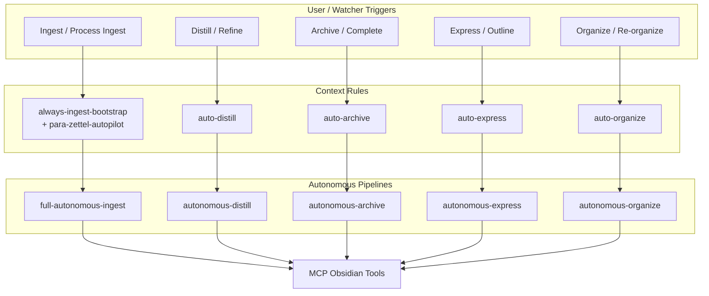
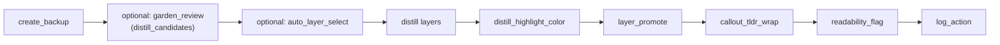
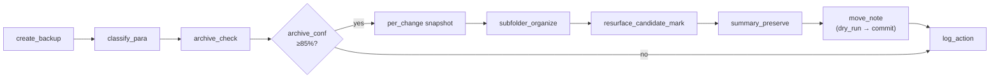
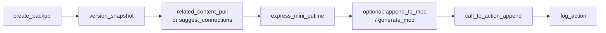
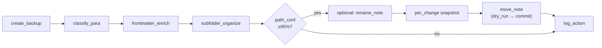
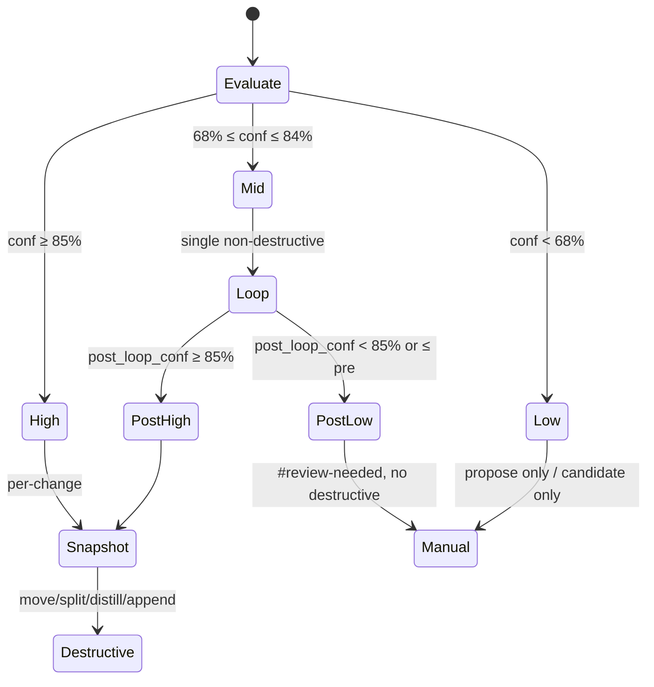
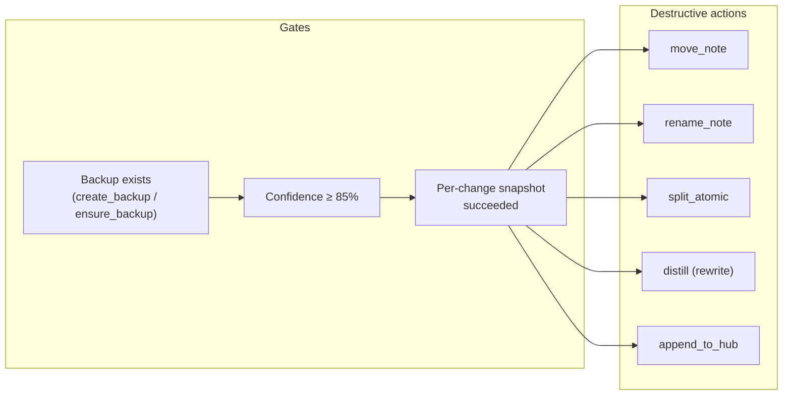
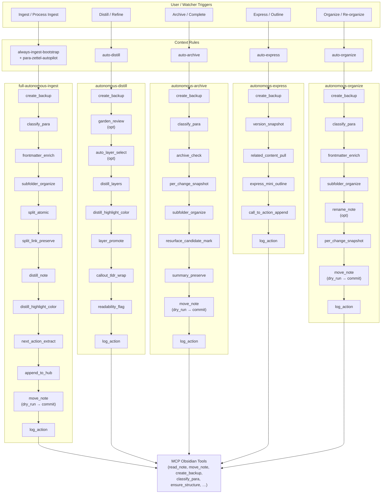

# Workflows, Pipelines & Skills Documentation Report

A single reference for the Second Brain vault’s **workflows**, **autonomous pipelines**, **skills**, **trigger → rule mapping**, and **safety** (backups, snapshots, confidence loops). Canonical pipeline order and gates live in [[Cursor-Skill-Pipelines-Reference]].

---

## 1. Overview

### 1.1 Architecture

- **Rules**: `.cursor/rules/always/` (always-applied) and `.cursor/rules/context/` (triggers/globs).
- **Skills**: `.cursor/skills/<skill-name>/SKILL.md` — reusable steps with confidence gates.
- **MCP**: Obsidian operations (read, move, backup, classify, etc.) via **obsidian-mcp-server** (global config only).
- **PARA**: 1-Projects, 2-Areas, 3-Resources, 4-Archives; subfolder depth ≤4 levels.

### 1.2 High-Level Flow

---

## 2. Trigger → Rule → Pipeline Mapping

| Trigger / phrase | Rule(s) | Pipeline |
|------------------|---------|----------|
| **EAT-QUEUE**, "Process queue", pasted EAT-CACHE payload | auto-eat-queue | **Queue processor**: read queue → skip queue_failed → dispatch by mode → Watcher-Result → clear passed only; tag failed with `queue_failed: true` |
| **EAT-QUEUE**, **PROCESS TASK QUEUE** (task/roadmap) | auto-queue-processor | Read Task-Queue.md → dispatch TASK-ROADMAP, TASK-COMPLETE, ADD-ROADMAP-ITEM, etc. → Watcher-Result + Mobile-Pending-Actions |
| "Ingest", "process Ingest", "run ingests" | always-ingest-bootstrap, para-zettel-autopilot | **full-autonomous-ingest** |
| Ingest/*.md (open or batch) | para-zettel-autopilot | full-autonomous-ingest |
| #raw-ingest, status: raw | auto-ingest-processing (propose only) | — |
| "Distill", "distill note/vault" | auto-distill | **autonomous-distill** |
| "Archive", #eaten, complete | auto-archive | **autonomous-archive** |
| "Organize", "re-organize", "ORGANIZE MODE" | auto-organize | **autonomous-organize** |
| "Resurface", "show resurface candidates" | auto-resurface | — |
| "GARDEN REVIEW", "orphans", "distill candidates" | (agent-interpreted) | Garden: `obsidian_garden_review` → distill/organize |
| "CURATE CLUSTER #tag", "theme gaps", "merge suggestions" | (agent-interpreted) | Curate: `obsidian_curate_cluster` → gaps/merges |
| MCP vault operations | mcp-obsidian-integration (always) | — |

**Watcher bridge**: Runs triggered by the Obsidian Watcher plugin (INGEST MODE, DISTILL MODE, etc.) or by **EAT-QUEUE** (queue-based) must append one line per request to `3-Resources/Watcher-Result.md` on finish: `requestId | status | message | trace | completed` (see watcher-result-append.mdc).

---

## 3. Pipeline Flowcharts (Detailed Mermaid)

### 3.1 full-autonomous-ingest

Ingest → classify → enrich → organize → split → distill → highlight → next-action → hub append → move → log.

```mermaid
flowchart LR
  subgraph bootstrap["Bootstrap (optional)"]
    A0["list_notes Ingest"]
    A0a["list_projects"]
    A0b["bootstrap_project_batch"]
  end

  subgraph core["Core pipeline"]
    A["create_backup"]
    B["classify_para"]
    C["frontmatter_enrich"]
    D["subfolder_organize"]
    E["split_atomic"]
    E2["split_link_preserve"]
    F["distill_note"]
    G["distill_highlight_color"]
    H["next_action_extract"]
    I["append_to_hub"]
    J["move_note\n(dry_run → commit)"]
    K["log_action"]
  end

  A0 --> A0a --> A0b
  A0b --> A
  A --> B --> C --> D --> E --> E2 --> F --> G --> H --> I --> J --> K
```

**Pre-steps (when Ingest has non-.md)**:
1. List non-.md in Ingest; for each: create companion .md per non-markdown-handling; leave original in Ingest/ with #needs-manual-move.
2. **Embedded image normalization**: rewrite image embeds to `5-Attachments/Images/`, add callout + #needs-attachment-relocation.

**Confidence**: Primary signal `ingest_conf` (after classify + frontmatter + path proposal). High ≥85% → full run after snapshot; Mid 68–84% → one self-critique loop; Low <68% → no destructive actions.

---

### 3.2 autonomous-distill

Refinement pass: backup → (optional garden_review) → optional auto-layer-select → distill layers → highlight → layer-promote → callout-tldr-wrap → readability-flag.

**Batch hint**: For >5 notes, pre-select with `obsidian_garden_review`(focus: distill_candidates). **Confidence**: `distill_conf` from auto-layer-select/depth; mid-band → single depth self-critique (shallower plan); low → readability-flag only.

---

### 3.3 autonomous-archive

Declutter complete/inactive → 4-Archives/: backup → classify → archive-check → snapshot → subfolder-organize → resurface-candidate-mark → summary-preserve → move → log.

**Confidence**: `archive_conf` from archive-check. High ≥85% → snapshot then full archive path; Mid 68–84% → one archive-refine loop; Low <68% → archive candidate only, no move.

---

### 3.4 autonomous-express

Turn distilled notes into output: backup → version-snapshot → related-content-pull → express-mini-outline → (optional MOC) → call-to-action-append.

**Confidence**: `express_conf`. High ≥85% → full outline + CTA; Mid 68–84% → soft loop (preview outline, then full or shorter commit); Low <68% → optional minimal CTA only.

---

### 3.5 autonomous-organize

Re-organize active PARA (1/2/3): backup → classify → frontmatter-enrich → subfolder-organize → optional rename → move → log.

**Confidence**: `path_conf` (re-org path fit). Mid-band → one neighbor/context loop with candidate paths; low → propose only, no rename/move.

---

## 4. Confidence Bands (Shared Model)

All pipelines use the same band definitions; only the **primary signal** name differs (`ingest_conf`, `distill_conf`, `archive_conf`, `express_conf`, `path_conf`).

**Loop invariants** (confidence-loops.mdc):
- At most **one** refinement loop per note per run.
- Loop content: metadata, self-critique, re-score, alternate paths — **no** move/rename/split/cross-note appends.
- If `post_loop_conf ≤ pre_loop_conf` → fall back to manual review, no destructive action.
- Destructive actions **only** when confidence ≥85% **and** per-change snapshot succeeded.

---

## 5. Skills Catalog

Skills live under `.cursor/skills/<name>/SKILL.md`. Slot = “after which step” in the pipeline.

### 5.1 Ingest

| Skill | Slot | Purpose | Confidence gate |
|-------|------|---------|------------------|
| **frontmatter-enrich** | classify_para | status, confidence, para-type, created, links (hub + related), optional project-id, priority, deadline; project MOC link | ≥85% full; ≥75% project fallback (lift to ≥82%) |
| **subfolder-organize** | frontmatter-enrich | Target path from para-type + project-id + themes (max 4 levels); ensure_structure then move | ≥85% new structure; ≥78% into existing folder |
| **split-link-preserve** | split_atomic | split_from on children, Splits section on parent; backlinks | ≥85% |
| **distill-highlight-color** | distill_note | Highlightr from master key + project highlight_key; color theory | ≥80% |
| **next-action-extract** | distill-highlight-color | Tasks → checklists + next-actions frontmatter | ≥85% |

### 5.2 Distill

| Skill | Slot | Purpose | Confidence gate |
|-------|------|---------|------------------|
| **auto-layer-select** | before distill | Suggest 1/2/3 layers from content complexity | ≥85% to apply |
| **distill-highlight-color** | after distill layers | Same as ingest | ≥80% |
| **layer-promote** | after highlight | Bold → highlight → TL;DR; project colors; contrast for conflicts | ≥85% |
| **callout-tldr-wrap** | after layer-promote | Wrap TL;DR in `> [!summary]` callout | always |
| **readability-flag** | end | needs-simplify + warning callout if low readability | ≥70% |

### 5.3 Archive

| Skill | Slot | Purpose | Confidence gate |
|-------|------|---------|------------------|
| **archive-check** | classify_para | No open tasks, status complete, age threshold; cross-check project | ≥85% for move |
| **subfolder-organize** | before move | Archive path 4-Archives/… from project-id/themes | ≥85% |
| **resurface-candidate-mark** | before move | resurface-candidate: true; optional Resurface hub append | ≥75% metadata; ≥85% hub |
| **summary-preserve** | before move | TL;DR/summary callout if missing; preserve project links | ≥80% |

### 5.4 Express

| Skill | Slot | Purpose | Confidence gate |
|-------|------|---------|------------------|
| **version-snapshot** | before major append | Dated copy in Versions/; mode "create"; preserve content/colors | ≥85% for write |
| **related-content-pull** | before outline | Semantic + project-id search → Related section; color theory | ≥80% |
| **express-mini-outline** | after read | Outline/summary fenced block; project colors | ≥85% for append |
| **call-to-action-append** | end | CTA callout (e.g. Share/Publish?) | always |

### 5.5 Organize

| Skill / step | Slot | Purpose | Confidence gate |
|--------------|------|---------|------------------|
| **frontmatter-enrich** | classify_para | Re-set status, confidence, para-type, links | ≥85% auto |
| **subfolder-organize** | frontmatter-enrich | Target path under 1/2/3 (re-org mode); max 4 levels | ≥85% for move |
| **obsidian_rename_note** | after path | Atomic title (e.g. YYYY-MM-DD-slug) | ≥85% |
| **obsidian_move_note** | after path | dry_run then commit; ensure_structure if needed | ≥85% |

### 5.6 Cross-Pipeline (Safety & Utility)

| Skill | Use | Purpose |
|-------|-----|--------|
| **obsidian-snapshot** | Before destructive steps in any pipeline | Per-change and batch snapshots in Backups/Per-Change, Backups/Batch; hashed, immutable; log in Backup-Log.md |
| **version-snapshot** | Express only | Narrative versions in Versions/ before appends |

---

## 6. Snapshot & Safety

### 6.1 Snapshot Triggers (by pipeline)

| Pipeline | Per-change triggers | Batch frequency |
|----------|---------------------|------------------|
| full-autonomous-ingest | Before split_atomic, distill_note (rewrite), append_to_hub, move_note, rename_note | Every 5 notes |
| autonomous-distill | Before first structural rewrite (distill layers / layer-promote) | ~Every 3 notes |
| autonomous-archive | After archive-check ≥85%, before subfolder-organize / summary-preserve / move | Once per sweep |
| autonomous-express | Before large appends (related, outline, CTA); version-snapshot alongside | Optional per batch |
| autonomous-organize | Before rename_note and before move_note (when ≥85%) | ~Every 3 notes |

### 6.2 Safety Invariants

- **Move**: Always `dry_run: true` then `dry_run: false`; on failure use fallback (ensure_structure → propose_alternative_paths → calibrate → verify → dry_run again).
- **No shell**: No `cp`/`mv`/`rm` on vault; all via MCP.
- **Watcher exclusions**: Do not move/delete notes with `watcher-protected: true` or fixed paths (e.g. Watcher-Signal.md, Watcher-Result.md, watched-file.md).

---

## 7. Error Handling & Logging

### 7.1 Error Handling Protocol (all pipelines)

On any pipeline or workflow failure:

1. **Trace**: timestamp (ISO 8601), pipeline, stage, note path(s), sanitized error.
2. **Summarize**: error_type, root cause, impact, suggested fixes, recovery (snapshot path if any).
3. **Log**: One entry in `3-Resources/Errors.md` (heading, metadata table, #### Trace, #### Summary); one-line reference in pipeline log (e.g. Ingest-Log.md).
4. **Severity**: High → approval pending, #review-needed; pause destructive steps for that note only; continue batch.

### 7.2 Log Line Format

`YYYY-MM-DD HH:MM | Excerpt: [snippet] | PARA: [type] | Changes: [list; include Backup: [path]] | Confidence: X% | Proposed MV: [path or 'stay'] | Flag: [none or #review-needed] | Loop: [attempted, type, pre, post, outcome, reason]`

### 7.3 Loop Logging Fields (Dataview)

- `loop_attempted`, `loop_band`, `pre_loop_conf`, `post_loop_conf`, `loop_outcome`, `loop_type`, `loop_reason`

---

## 8. Skill Locations (Quick Reference)

| Skill | Path |
|-------|------|
| obsidian-snapshot | .cursor/skills/obsidian-snapshot/SKILL.md |
| version-snapshot | .cursor/skills/version-snapshot/SKILL.md |
| frontmatter-enrich | .cursor/skills/frontmatter-enrich/SKILL.md |
| subfolder-organize | .cursor/skills/subfolder-organize/SKILL.md |
| split-link-preserve | .cursor/skills/split-link-preserve/SKILL.md |
| distill-highlight-color | .cursor/skills/distill-highlight-color/SKILL.md |
| next-action-extract | .cursor/skills/next-action-extract/SKILL.md |
| auto-layer-select | .cursor/skills/auto-layer-select/SKILL.md |
| layer-promote | .cursor/skills/layer-promote/SKILL.md |
| callout-tldr-wrap | .cursor/skills/callout-tldr-wrap/SKILL.md |
| readability-flag | .cursor/skills/readability-flag/SKILL.md |
| archive-check | .cursor/skills/archive-check/SKILL.md |
| resurface-candidate-mark | .cursor/skills/resurface-candidate-mark/SKILL.md |
| summary-preserve | .cursor/skills/summary-preserve/SKILL.md |
| related-content-pull | .cursor/skills/related-content-pull/SKILL.md |
| express-mini-outline | .cursor/skills/express-mini-outline/SKILL.md |
| call-to-action-append | .cursor/skills/call-to-action-append/SKILL.md |

---

## 9. Related References

- **Canonical pipeline order, gates, tables**: [[Cursor-Skill-Pipelines-Reference]]
- **MCP safety, fallbacks, backup/snapshot config**: `.cursor/rules/always/mcp-obsidian-integration.mdc`
- **Confidence bands and self-critique template**: `.cursor/rules/always/confidence-loops.mdc`
- **Ingest bootstrap**: `.cursor/rules/always/always-ingest-bootstrap.mdc`
- **Watcher result contract**: `.cursor/rules/always/watcher-result-append.mdc`

---

## 10. Master Diagram: Triggers → Rules → Pipelines (Expanded)

End-to-end view: triggers and context rules at the top, then each autonomous pipeline expanded into its individual steps, all converging on MCP Obsidian tools.

