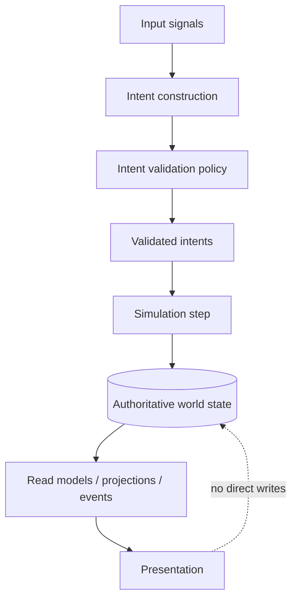
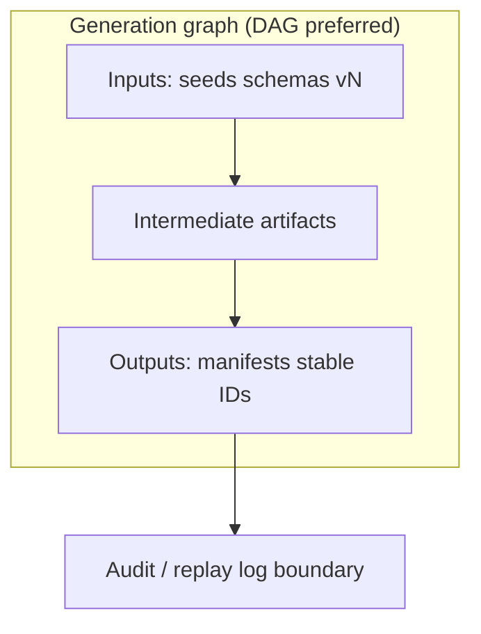

## Phase 1.1 — Layer boundaries and modularity seams

Separate **world state**, **simulation**, **rendering**, and **input** with explicit dependency direction. Document **generation graph** stage boundaries and **intent resolver** injection points. Enumerate **replaceability seams** (generation stages, rule hooks, event bus) as checklist targets for deepen.

## Diagrams (stack-agnostic)

### Layer dependency direction

**Contract:** Only **simulation** advances **authoritative state** from **validated intents**. **Presentation** consumes **derived** views. **D-027:** shapes are normative; any engine/renderer names elsewhere are illustrative only.

### Generation graph seam

Cycles, if allowed, require explicit **hazard analysis** and **termination** (see Edge cases).

## Stage contract table (stub)

| Stage (illustrative) | Inputs | Outputs | Determinism / replay key | Failure surface | Recovery posture |
| --- | --- | --- | --- | --- | --- |
| Authoritative tick | Prior manifest + validated intents + ordering | State delta + run log slice | Input hash + intent IDs + ordering | Invalid intent / policy reject | **Fail-closed** |
| Worldgen slice | Upstream schema **vN** | Layout / entity refs (IDs) | Seed + stage order + schema hash | Schema mismatch | **Fail-closed** or **quarantine** |
| Presentation bake *(execution)* | Read models | Draw/stream lists | *(execution track)* | Timeout / OOM *(execution)* | **Degrade** or **abort** *(TBD)* |

Row labels are **contract placeholders**; concrete types and storage live on **execution track**.

## Intent → resolver hook mapping

| Intent lane | Hooks / adapters (conceptual) | Invariant |
| --- | --- | --- |
| Player / operator | Authority, dedupe, capability checks | No silent mutation of authoritative state |
| Simulation / world events | Reputation, environment policy, scripted reactions | Hooks observe **after** validation |
| Generation pipeline | Per-stage manifest validators | Typed outputs only; shared namespaces explicit |

## Research integration (pre-deepen)

> [!note] External grounding (nested Research, light synthesis)
> **Layers (dependency direction).** **Authoritative world state** is the normative truth for the running product. **Simulation** applies **validated intents** (plus time/tick or turn rules) to advance that state; it must not depend on frame layout, shaders, or input device details. **Presentation** consumes **read models** or stable **events/projections** derived from state—never the only path that writes core facts. **Input** turns raw signals into **intent candidates**, then runs validation (policy, authority, dedupe, capability checks) before simulation sees them. Prefer edges: input → intents → simulation → state; presentation ← derived views ← state. Name anti-patterns explicitly: presentation mutating authoritative state, “simulation” driven by render callbacks, intents that bypass validation, or hidden feedback that changes state without a logged intent.
>
> **Multi-stage procedural generation (contracts).** Treat generation as an ordered **stage graph** (often a DAG; any cycle needs a documented hazard and termination story). Per stage, specify **inputs** (schemas, versions, seed identity), **outputs** (artifacts, manifests, stable IDs), **determinism/replay key** (what must match for identical results), and **ownership** of each seam. **Failure surfaces** to document: upstream schema/version mismatch; partial writes without a rollback boundary; nondeterminism breaking replay; timeout or resource exhaustion; two stages claiming the same output namespace. For each failure class, state whether the pipeline **fails closed**, **degrades with explicit defaults**, or **quarantines** bad output—and what is logged for audit/replay. This stays stack-agnostic: engines and languages are illustrative elsewhere only (**D-027**).

### Scope

Defines **dependency direction** and **modularity seams** between world state, simulation, rendering, and input, plus generation graph stage boundaries. Does **not** specify threading models, GPU APIs, or ECS storage (**execution track**).

### Behavior

**World state** is authoritative for simulation; **simulation** advances that state from validated intents; **rendering** consumes derived read models; **input** produces intents through a validation layer (no direct silent mutation of authoritative state). **Generation graph** runs as ordered stages with declared inputs/outputs per stage; **intent resolver** hooks attach reputation, events, and environment policy without hard-coding a single engine.

### Interfaces

**Inward:** Phase 1 primary scope/behavior; PMG Technical Integration themes. **Outward:** clear “allowed edges” between layers for Phase 2–4; seam list (stages, rule hooks, event bus) for replaceability analysis.

### Edge cases

Feedback loops that skip intent validation; render-driven simulation shortcuts; stage cycles in the generation graph — all **named as anti-patterns** to be blocked by contracts. Cross-platform input normalization **TBD**.

### Open questions

- Exact cardinality of intent types vs input device classes (**deferred** to perspective/control phases).
- Whether generation stages are strictly DAG or allow controlled cycles (**TBD** with hazard analysis).

### Pseudo-code readiness

Reader can trace **one-way dependencies** and **stage I/O + failure posture** from diagrams and the stub table without guessing core ordering.

- [x] Layer diagram + allowed dependencies (one-way arrows).
- [x] Stage contract table (inputs/outputs/failure modes) — stub row set until execution typing.
- [x] Intent → hook mapping overview (reputation, events, env state).

## Risk register v0

| Risk | Mitigation (conceptual) | Owner track |
| --- | --- | --- |
| Invalid layer edge (render writes authoritative state) | Enforce validation + one-way sim→state; diagram + contracts | Conceptual |
| Partial generation write without rollback boundary | Stage manifests + fail-closed/quarantine posture in table | Conceptual → execution typing |
| Intent validation bypass | Policy hooks mandatory on intent lane; audit logged intents | Conceptual |
| Schema/version mismatch between stages | Versioned inputs column; fail-closed row | Conceptual |
| Generation graph cycle without termination | DAG default; cycles require hazard doc (Open questions) | Conceptual |

## Tertiary notes (1.1.x)

First tertiary **1.1.1** lives under the **layer-seams folder** (organizational subtree for this secondary):

- [[Phase-1-1-Layer-Boundaries-and-Modularity-Seams/Phase-1-1-1-Replaceability-Seams-and-Hook-Surface-Roadmap-2026-03-29-1905]] — **Replaceability seams** catalog (**S-L** / **S-G** / **S-H**) with mid-technical interface sketches; **D-027** preserved.
- [[Phase-1-1-Layer-Boundaries-and-Modularity-Seams/Phase-1-1-2-Event-Bus-Topology-and-Mod-Load-Order-Roadmap-2026-03-29-1915]] — **Event bus topology** (partitioned domains, bridges) and **mod-load order** / registration bands; **D-027** preserved.

> [!success] Waiver resolved
> Prior `#review-needed` deferral for missing **1.1.x** is **cleared** by minting **1.1.1** on **2026-03-29** (`queue_entry_id: resume-deepen-gmm-phase11-next-tertiary-or-waiver-20260329T190500Z`). No shallow-tree operator decision was required.
