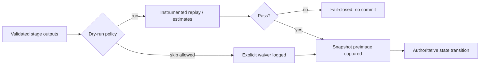

## Phase 1.2 — Safety invariants (snapshots and dry-run)

Prototype **generation run snapshots** (seed + overrides + intent state), **dry-run** passes for performance/rule validity estimates, and **provenance** embed rules per PMG Technical Integration. **Aligns with** [[Phase-1-1-Layer-Boundaries-and-Modularity-Seams-Roadmap-2026-03-29-1731]] stage table: each commit must cross a **manifest + validator** boundary before touching authoritative state (**D-027**: field names below are conceptual, not normative wire formats).

### Scope

Covers **when** a generation/simulation commit is safe to persist: snapshot boundaries, dry-run vs commit gates, and traceability expectations. Does **not** define concrete storage formats, hashing algorithms, or CI job YAML (**execution track**).

### Behavior

Before **commit**, the pipeline may run a **dry-run** path that exercises the same stage graph with instrumentation-only outputs (no durable authoritative state write). A **snapshot** bundles the inputs required to reproduce or audit a commit (seed manifest, overrides, intent state at boundary). **Ordering:** validate inputs → dry-run (optional but recommended for heavy stages) → commit snapshot metadata alongside authoritative state transition.

### Interfaces

**Inward:** expects stage contracts from **1.1** (layer/graph seams) and generation manifest shape from Phase 1 primary. **Outward:** guarantees that every committed generation run is associated with a reproducible snapshot contract in words; Phase 2+ may attach concrete formats.

### Edge cases

Conflicting overrides, partial stage failure, and nondeterministic external inputs must be classified (fail closed vs soft warning) — **TBD** with explicit contract on execution track. Clock skew and distributed generation are **out of scope** for this conceptual slice.

### Open questions

- Whether dry-run is default-on for author builds vs opt-in for iteration speed (**TBD**).
- Retention policy for snapshots (**deferred** to operations / execution).

## Snapshot preimage field sketch (vault-normative strings)

These **string identities** are what designers and tools exchange in-repo (filenames, frontmatter, manifest rows)—not byte layouts:

| Field (conceptual) | Role | Must appear in audit trail |
| --- | --- | --- |
| `seed_identity` | Stable id of the seed pack / campaign root | Yes |
| `schema_generation` | Version of generation schema contract (e.g. `vN` per 1.1 table) | Yes |
| `override_fingerprint` | Hash or content-id of active overrides at boundary | Yes |
| `intent_boundary_cursor` | Last validated intent sequence / tick marker at commit | Yes |
| `stage_manifest_ref` | Pointer to per-stage outputs that fed this commit | Yes |
| `dry_run_artifact_ref` | Optional link to dry-run summary when run | When dry-run executed |
| `operator_attestation` | Who/what approved commit (session, role) | Recommended |

**Contract:** a **commit** is **invalid** without `seed_identity`, `schema_generation`, and `stage_manifest_ref` at minimum; execution track defines encoding.

## Dry-run vs commit gate placement

Dry-run sits **after** per-stage validators and **before** any write that downstream stages treat as authoritative. Commits that skip dry-run must log **`dry_run_skipped: reason`** in the conceptual contract (execution implements).



## Traceability (provenance)

Each **generated element** (entity, biome ref, POI, rule hook) should be attributable to a **closed set** of inputs: seed fields, override ids, stage ids, and module ids that participated in its creation. **Conceptual rule:** no anonymous “mystery” provenance in the commit manifest—either list contributors or mark **`provenance_partial: TBD`** with execution follow-up. This mirrors PMG **provenance embed** without picking a storage engine.

### Pseudo-code readiness

Reader can sketch `DryRunPipeline(manifest)`, `CaptureSnapshot(inputs)`, `CommitIfValid(snapshotRef, stateDelta)` without inventing core ordering.

```text
function CaptureSnapshot(preimage: SnapshotPreimage) -> SnapshotRef
  // preimage bundles vault-normative string fields + stage_manifest_ref
  // execution: serialize bytes, hash, store

function DryRunPipeline(manifest: StageManifest) -> DryRunReport | Error
  // no authoritative writes; may estimate cost / rule conflicts

function CommitIfValid(snapshotRef: SnapshotRef, stateDelta: StateDelta) -> OK | Reject
  // Reject if snapshotRef not recorded or preimage incomplete per table above
```

### Handoff checklist (slice)

- [x] **Snapshot preimage** field sketch (vault-normative strings).
- [x] **Dry-run vs commit** gate placement in generation graph (diagram + ordering).
- [x] **Traceability:** which inputs/modules shaped each generated element (provenance rule).

## Tertiary notes (1.2.x)

```dataview
TABLE WITHOUT ID roadmap-level AS "Level", file.link AS "Note", subphase-index AS "Index", status, progress AS "%"
FROM "1-Projects/genesis-mythos-master/Roadmap/Phase-1-Conceptual-Foundation-and-Core-Architecture/Phase-1-2-Safety-Invariants-Snapshots-and-Dry-Run"
WHERE roadmap-level = "secondary" OR roadmap-level = "tertiary" OR roadmap-level = "task"
SORT subphase-index ASC, file.name ASC
```

- **1.2.1** — [[Phase-1-2-Safety-Invariants-Snapshots-and-Dry-Run/Phase-1-2-1-Snapshot-Preimage-Binding-and-Audit-Trail-Roadmap-2026-03-29-1935]] — preimage→commit binding, boundary ticket closure, post-commit audit minimum.
- **1.2.2** — [[Phase-1-2-Safety-Invariants-Snapshots-and-Dry-Run/Phase-1-2-2-Dry-Run-Waiver-and-Bypass-Policy-Roadmap-2026-03-29-1940]] — dry-run waiver ladder, audit coupling, ticket conflict rules.

Next structural options: **1.2.3** (retention intent), peer **1.3** per Phase 1 MOC, or Phase 1 primary checklist closure.

## Related

- [[Phase-1-1-Layer-Boundaries-and-Modularity-Seams-Roadmap-2026-03-29-1731]] — stage contracts and fail-closed rows.
- [[Phase-1-Conceptual-Foundation-and-Core-Architecture-Roadmap-2026-03-29-1730]] — Phase 1 primary checklist.
