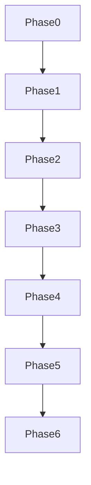

# Distilled core — genesis-mythos-master

## Phase 0 anchors

- Master goal: [[Genesis-mythos-master-goal]]
- Roadmap state: [[roadmap-state]]
- Workflow state: [[workflow_state]]
- Decisions log: [[decisions-log]]

## Core decisions (🔵)

- **D-027** — Stack-agnostic design authority: cross-runtime contracts only; no inferred engine from examples ([[decisions-log]], [[Genesis-mythos-master-goal]] Technical Integration).
- **Phase 0 (2026-03-29)** — Roadmap regenerated from PMG after archive; [[4-Archives/genesis-mythos-master-restart-2026-03-29/Roadmap/|archived Roadmap/]] holds pre-restart depth — reference only unless operator merges explicitly.

## Phase 1 conceptual spine (live tree)

- **1.1** Layer seams + generation graph + intent hooks — [[Phase-1-1-Layer-Boundaries-and-Modularity-Seams-Roadmap-2026-03-29-1731]]; tertiaries **1.1.1** seams catalog, **1.1.2** bus topology / mod-load bands.
- **1.2** Snapshots, dry-run gates, snapshot preimage fields, provenance rule — [[Phase-1-2-Safety-Invariants-Snapshots-and-Dry-Run-Roadmap-2026-03-29-1731]] (bytes, hashes, CI, retention = **execution-deferred** per note `handoff_gaps`).

## Dependency graph

