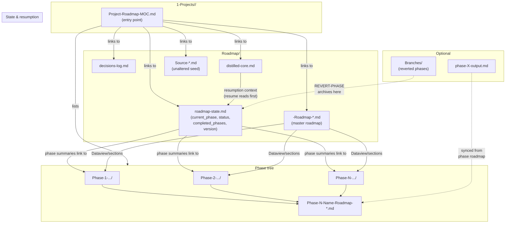
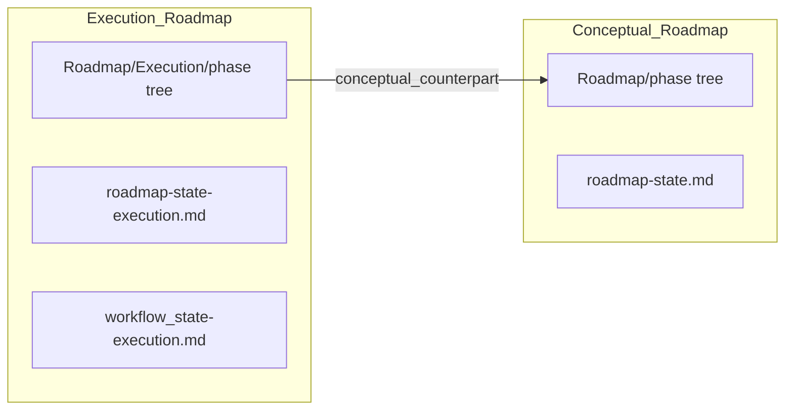
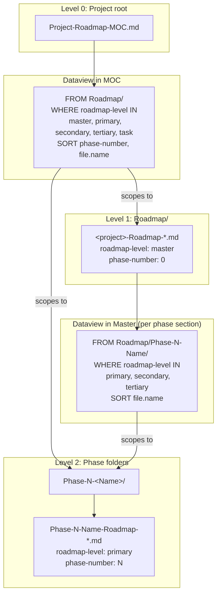
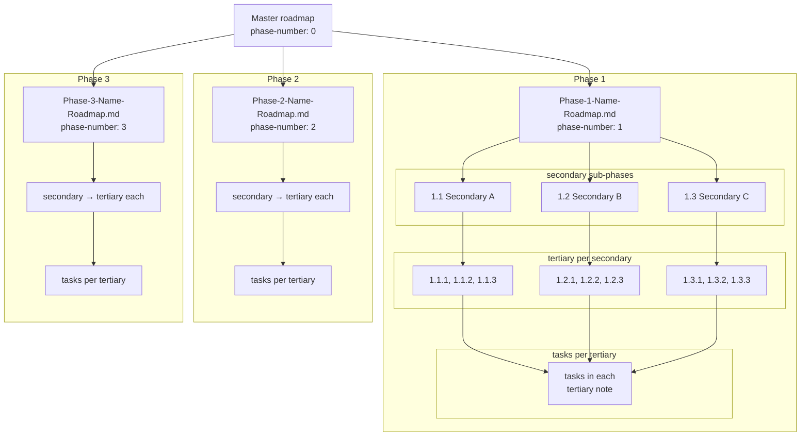

## Mermaid diagram: roadmap structure

Use this in a note (e.g. in `3-Resources/Second-Brain/` or inside Vault-Layout) so it stays with the rest of the docs.



### Execution subtree (dual track)

When the project is in **execution** mode (`roadmap_track: execution` on `roadmap-state.md`), deepen/recal writes live under **`Roadmap/Execution/`** with the **same folder patterns** as the conceptual tree (e.g. `Roadmap/Execution/Phase-1-<Name>/…`). Conceptual files under `Roadmap/` (outside `Execution/`) stay **frozen** and read-only for agents.



**Frontmatter linking**

- **Execution** notes: `roadmap_track: execution`, `conceptual_counterpart: "[[Roadmap/Phase-1-…/note]]"` (or vault path string).
- **Conceptual** notes (optional): `execution_mirror: "[[Roadmap/Execution/Phase-1-…/note]]"`.

---

## Nesting structure with Dataview

How roadmap notes nest by **folder scope** and **frontmatter** so each level can query the level below with Dataview.



**Nesting rules:**

| Level | Note / location | Dataview FROM | Frontmatter filter | Shows |
|-------|------------------|---------------|--------------------|--------|
| 0 | Project root → MOC | `"1-Projects/<project-id>/Roadmap"` | `roadmap-level = "master" OR "primary" OR "secondary" OR "tertiary" OR "task"` | Master + all phase (and subphase) notes in Roadmap |
| 1 | Roadmap/ → master roadmap | `"…/Roadmap/Phase-N-<Name>"` (one block per phase) | `roadmap-level = "primary" OR "secondary" OR "tertiary"` | Phase roadmap note + any subphase notes in that phase folder |

Phase folders are the **scope boundary**: the MOC queries the whole `Roadmap/` tree; the master roadmap queries one folder per phase. Use `roadmap-level` and `phase-number` in frontmatter so Dataview can filter and sort. Subphase notes (if added) live in the same `Phase-N-<Name>/` folder and are picked up by the master’s per-phase query.

---

## Complete hierarchy: phases → secondary → tertiary → tasks

The roadmap supports four levels: **master** → **phases** → **secondary sub-phases** → **tertiary sub-phases** → **tasks**. Each level can have any number of children (e.g. P phases, each with S secondary, each with T tertiary, each with J tasks). Use this as the canonical depth model for folder scope and Dataview.

**Example:** 3 phases × 3 secondary × 3 tertiary × 3 tasks = 1 master + 3 phase notes + 9 secondary + 27 tertiary notes + 81 tasks in tertiary note bodies.

### Hierarchy diagram (example with 3 at each level)



### Folder and note layout

| Level | Count (general) | Example (3×3×3×3) | Path pattern | Frontmatter | Contents |
|-------|-----------------|-------------------|--------------|-------------|----------|
| **Master** | 1 | 1 | `Roadmap/<project>-Roadmap-*.md` | `roadmap-level: master`, `phase-number: 0` | Sections per phase; one Dataview per phase folder. |
| **Phase** | P | 3 | `Roadmap/Phase-N-<Name>/Phase-N-<Name>-Roadmap-*.md` | `roadmap-level: primary`, `phase-number: N` | Sections per secondary; one Dataview per secondary folder (Level column: primary/secondary/tertiary). |
| **Secondary** | P×S | 9 | `Roadmap/Phase-N-<Name>/Phase-N-M-<SecondaryName>/Phase-N-M-<SecondaryName>-Roadmap-*.md` | `roadmap-level: secondary`, `phase-number: N`, `subphase-index: "N.M"` | Sections per tertiary; one Dataview per tertiary (or one scoped to folder; Level: secondary/tertiary/task). |
| **Tertiary** | P×S×T | 27 | `Roadmap/Phase-N-…/Phase-N-M-…/Phase-N-M-K-<TertiaryName>.md` | `roadmap-level: tertiary`, `phase-number: N`, `subphase-index: "N.M.K"` | **Tasks** as checklist items `- [ ]` (or task blocks). |
| **Tasks** | P×S×T×J | 81 | Inside tertiary note | — | Checklist items under headings or a single task list. |

Example folder tree (Phase 1 with 3 secondary, 3 tertiary each):

```
Roadmap/
├── <project>-Roadmap-*.md                    # master
├── Phase-1-Conceptual-Foundation/
│   ├── Phase-1-Conceptual-Foundation-Roadmap-*.md
│   ├── Phase-1-1-Core-Abstractions/
│   │   ├── Phase-1-1-Core-Abstractions-Roadmap-*.md   # secondary
│   │   ├── Phase-1-1-1-World-State.md                 # tertiary (tasks in body)
│   │   ├── Phase-1-1-2-Simulation-API.md
│   │   └── Phase-1-1-3-Rendering-Input.md
│   ├── Phase-1-2-Generation-Pipeline/
│   │   ├── Phase-1-2-Generation-Pipeline-Roadmap-*.md
│   │   ├── Phase-1-2-1-Seed-Terrain.md
│   │   ├── Phase-1-2-2-Biome-POI.md
│   │   └── Phase-1-2-3-Entity-Bootstrap.md
│   └── Phase-1-3-Modularity-Safety/
│       ├── Phase-1-3-Modularity-Safety-Roadmap-*.md
│       ├── Phase-1-3-1-Stages-Seams.md
│       ├── Phase-1-3-2-Rule-Hooks.md
│       └── Phase-1-3-3-Safety-Invariants.md
├── Phase-2-.../
└── Phase-3-.../
```

### Dataview at each level

| Level | Note that runs the query | FROM | WHERE (and SORT) | Shows |
|-------|--------------------------|------|------------------|--------|
| **MOC** | Project-Roadmap-MOC.md | `"1-Projects/<id>/Roadmap"` | `roadmap-level = "master" OR "primary" OR "secondary" OR "tertiary" OR "task"` · SORT phase-number, subphase-index, file.name · TABLE includes Level column | Master + all phase + all subphase notes. |
| **Master** | &lt;project&gt;-Roadmap-*.md | `"…/Roadmap/Phase-N-<Name>"` (one block per phase) | `roadmap-level = "primary" OR "secondary" OR "tertiary"` · SORT subphase-index, file.name · TABLE includes Level column | Phase note + that phase’s secondary (and deeper) notes. |
| **Phase** | Phase-N-Name-Roadmap-*.md | `"…/Phase-N-Name/Phase-N-M-<Secondary>"` (one block per secondary folder) | `roadmap-level = "secondary" OR "tertiary"` · SORT subphase-index, file.name · TABLE includes Level column | Secondary roadmap + that secondary’s tertiary notes. |
| **Secondary** | Phase-N-M-SecondaryName-Roadmap-*.md | `"…/Phase-N-M-SecondaryName/"` | `roadmap-level = "secondary" OR "tertiary" OR "task"` · SORT subphase-index, file.name · TABLE includes Level column | Tertiary and task notes in that folder (each with tasks in body or pseudo-code). |

Tertiary notes do not run Dataview for structure; they contain **tasks** as checklist items (e.g. 3 per note). Use `subphase-index: "N.M.K"` (e.g. `"1.1.1"`) so queries from phase or secondary can list and sort all tertiary notes.

---

### Canonical block for distilled-core (aggressive deepening)

When setting up aggressive deepening, **append this block** (or a condensed version) to the project’s `Roadmap/distilled-core.md` so every resume/expand reads it:

**Hierarchy rule (enforce always):**

- Master MOC links to phase MOCs.
- Each phase note is MOC for its secondary sub-phases (folders + Dataview block).
- Each secondary note is MOC for its tertiary notes (folder + Dataview).
- Tertiary notes contain only tasks/checklists/pseudo-code (no further Dataview MOC).
- Use `subphase-index: "N.M"` for secondary, `"N.M.K"` for tertiary.
- Folder pattern: `Roadmap/Phase-N-.../Phase-N-M-.../Phase-N-M-K-....md`

Optionally add the same ref to `workflow_state.md` (e.g. one-line: “Resume/expand must follow hierarchy in [[1-Projects/Test-Project/Versions/post-Monolithic/temp/distilled-core#Hierarchy rule]]”). See [[3-Resources/Second-Brain/Roadmap-Quality-Guide#Aggressive deepening (crank the levers)|Roadmap-Quality-Guide § Aggressive deepening]] for queue chain and validation.
