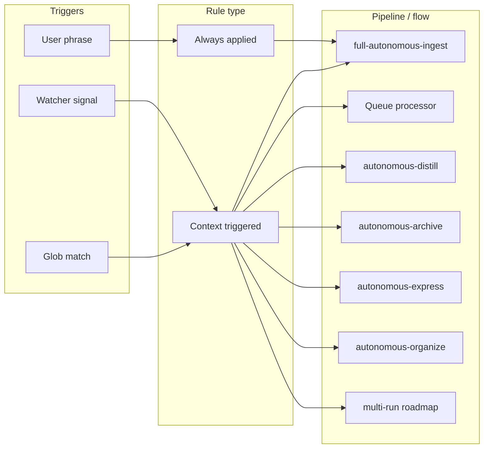
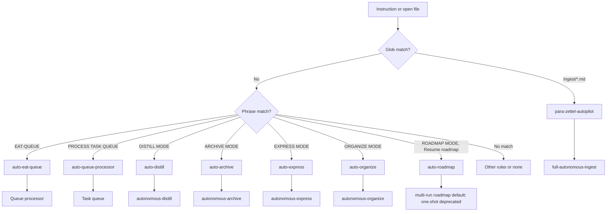

**TL;DR** — Map of always-applied and context (triggered) rules; full text lives in `.cursor/rules/always/*.mdc` and `.cursor/rules/context/*.mdc`. Use the Quick Reference table and diagrams to see trigger → rule → pipeline; questions and options come from User-Questions-and-Options-Reference §1.

**Nested helper attestation (EAT-QUEUE):** Pipeline Task returns should include **`validator_context`** (when **`little_val_ok: true`**) and **`nested_subagent_ledger`** for modes that use nested Validator / IRA / Research. Layer 1 strict consumption and continuation log **`nested_attestation_failure`** are controlled by [[3-Resources/Second-Brain-Config|Second-Brain-Config]] § **`queue`**; see [[3-Resources/Second-Brain/Parameters|Parameters]] § Queue nested attestation, [[3-Resources/Second-Brain/Docs/Nested-Subagent-Ledger-Spec|Nested-Subagent-Ledger-Spec]], [[3-Resources/Second-Brain/Docs/Queue-Continuation-Spec|Queue-Continuation-Spec]].

---

## Quick Reference Table

| Trigger Phrase | Pipeline | Rule(s) that fire | Confidence Gate | Safety Step First |
|----------------|----------|-------------------|------------------|--------------------|
| INGEST MODE, Process Ingest | full-autonomous-ingest | always-ingest-bootstrap, para-zettel-autopilot | Phase 1 low → wrapper | create_backup |
| EAT-QUEUE, Process queue, EAT-CACHE | Queue processor | auto-eat-queue | — | Step 0 wrappers first; dry_run pattern |
| DISTILL MODE | autonomous-distill | auto-distill | ≥85% destructive | create_backup, snapshot before rewrite |
| ARCHIVE MODE | autonomous-archive | auto-archive | ≥85% move | create_backup, snapshot before move |
| EXPRESS MODE | autonomous-express | auto-express | ≥85% appends | version-snapshot, backup |
| ORGANIZE MODE | autonomous-organize | auto-organize | ≥85% move/rename | create_backup, dry_run before move |
| ROADMAP MODE, Resume roadmap | multi-run roadmap | auto-roadmap | conf ≥85% phase complete | snapshot state before/after update |
| ROADMAP_HANDOFF_VALIDATE (queue) | validator (roadmap_handoff) | agents/validator, queue | read-only except report | model from Config § validator.roadmap_handoff.model; manual trigger only |
| We are making a prompt / CODE / ROADMAP | Question-led crafting | plan-mode-prompt-crafter | — | Validate before append; read-then-append only |
| REPAIR CRAFT, PROMPT CRAFT RECOVERY | PromptCraftSubagent (recovery JSONL suggestions) | dispatcher → Task(prompt_craft); agents/prompt-craft | — | Read-mostly; Layer 0 does not append queue; Layer 1 **A.5d** / optional **A.5b** / optional **A.1b** empty-queue bootstrap (queue.mdc); see [[3-Resources/Second-Brain/Docs/Prompt-Craft-Subagent|Prompt-Craft-Subagent]], [[3-Resources/Second-Brain/Docs/Queue-Continuation-Spec|Queue-Continuation-Spec]] |
| (post–EAT-QUEUE success path) | GitForge (git/export tail) | queue.mdc **A.7a** → Task(gitforge); agents/gitforge | — | When **`gitforge.enabled`** and **`effective_pipeline_mode`** is **`balance`** or **`quality`** (not **`speed`**); **once** after prompt-queue **A.7**; see [[3-Resources/Second-Brain/Docs/git-audit-log|git-audit-log]], [[3-Resources/Second-Brain/Docs/git-push-workflow-2026-04-02-0446|git-push-workflow]] |
| update the githubs, publish vault, ship to github, run publish sequence, curator + export, git publish | Curator + publish orchestration | context/publish-to-github | — | **`curator_snapshot.sh`** first; GitForge **only** via EAT-QUEUE **A.7a** (not standalone Task); else manual [[.cursor/skills/vault-git-publish-checklist/SKILL|vault-git-publish-checklist]] |

---

## Mermaid — Trigger to rule to pipeline

## Mermaid — Context rule decision flow

---

## Safety Invariants

> [!warning] **Backup and snapshot**
> No destructive MCP operations without backup (create_backup or ensure_backup). Per-change snapshot required before move, rename, split, structural distill, or append_to_hub. Pipelines must align with `Parameters.md` and core-guardrails.mdc.

> [!warning] **dry_run before move**
> Always call `obsidian_move_note` with `dry_run: true` first; review effects; then commit with `dry_run: false`. After move, set para-type (and project-id under 1-Projects/, status: archived under 4-Archives/) on the note at new path.

> [!warning] **Queue append (prompt crafter)**
> Only vault write in question-led crafting = append to queue after user confirms (Final question: [[3-Resources/Second-Brain/User-Questions-and-Options-Reference|User-Questions-and-Options-Reference]] §1 Message 9 — A. yes append | B. no cancel | C. AI reasoning). Validate payload before append; on decline (B), do not write. Read-then-append only; never overwrite file with just the new line.

---

## Detailed Breakdown

### Always-applied rules

| Rule file | Purpose | Responsibilities |
|-----------|---------|------------------|
| `core-guardrails.mdc` | Global safety, persona, PARA, MCP guardrails | Thoth-AI persona; PARA-only roots; all-new-files-in-Ingest stance; shared confidence bands and loop invariants; backup + per-change snapshot gates for all destructive actions; no shell mv/cp/rm on the vault; protected paths and exclusions; Error Handling Protocol summary. Pipelines must treat this as the single canonical safety contract and align thresholds with `Parameters.md`. |
| `system-funnels.mdc` | Entry routing and funnels; Prompt-Crafter vs manual/advanced triggers | Defines Prompt-Crafter as the preferred/primary entry door for automation (question-led Q&A that emits validated `mode` + `params` payloads); treats raw mode phrases (INGEST MODE, DISTILL MODE, EXPRESS MODE, ARCHIVE MODE, EAT-QUEUE/EAT-CACHE, PROCESS TASK QUEUE, ROADMAP MODE, RESUME-ROADMAP, RECAL-ROAD, etc.) as manual/advanced triggers; maps each phrase to context rules (ingest-processing, para-zettel-autopilot, auto-distill, auto-express, auto-archive, auto-organize, auto-eat-queue, auto-queue-processor, auto-roadmap, garden/cluster flows); declares when runs are guidance-aware and when to use the Watcher bridge, while deferring details to `guidance-aware.mdc` and `watcher-result-append.mdc`. |
| `dispatcher.mdc` | Queue-trigger routing; Layer 0 must not run queue logic inline | When the user says **EAT-QUEUE**, **Process queue**, **EAT-CACHE** / **eat cache**, or **PROCESS TASK QUEUE**, the parent agent **only** builds a hand-off and calls the Cursor **`Task`** tool with **subagent_type `queue`** (Queue/Dispatcher subagent). Layer 0 does not read `prompt-queue.jsonl` or run Step 0 / dispatch inline. **REPAIR CRAFT** / **PROMPT CRAFT RECOVERY** → **`Task(prompt_craft)`** per same rule. **Task `model`:** omit for parent-session model; use `"fast"` only when intended; never `model: "inherit"` on Task calls (invalid API). See [[3-Resources/Second-Brain/Docs/Rules/Dispatcher-Rule|Dispatcher-Rule]], [[3-Resources/Second-Brain/Subagent-Safety-Contract|Subagent-Safety-Contract]] § Cursor Task tool: `model` parameter. |
| `00-always-core.mdc` | Persona (Thoth-AI), Ingest-first; all new files in Ingest/; frontmatter on every new .md | Persona; ensure all new/unknown files start in Ingest/; frontmatter (created, tags) on every new .md |
| `mcp-obsidian-integration.mdc` | Backups, MCP usage, snapshots, fallbacks; ensure_backup vs create_backup; dry_run before move; post-move frontmatter sync; Error Handling Protocol; restore-queue mode | Backup/snapshot gates; dry_run before move_note; after move set para-type (and project-id when under 1-Projects/, status: archived when under 4-Archives/) on note at new_path; Error Handling Protocol to Errors.md; fallback table (ensure_structure, propose_alternative_paths backed by ranked PARA proposals from `propose_para_paths`); **restore-queue** mode (user-maintained Restore-Queue.md; processor restores snapshots one-by-one; no auto-restore). |
| `second-brain-standards.mdc` | PARA, atomic notes, attachments; frontmatter, tags, `![[5-Attachments/...]]` | PARA structure; atomic notes; attachment syntax; searchable title and tags |
| `confidence-loops.mdc` | Bands 68–84, ≥85, <68; single refinement loop per note; loop_* fields; loop-skip flag | Define confidence bands; one non-destructive loop in mid-band; loop_* in logs; **`loop-skip: true` / `skip_refinement_loop: true`** frontmatter flag tells pipelines to skip the mid-band refinement loop for that note (trusted path) and either commit (if already ≥85%) or treat as proposal only. |
| `guidance-aware.mdc` | Guidance-Aware Run Contract; user_guidance + queue prompt as soft hints; guidance_conf_boost | Trigger: approved + user_guidance, or queue prompt + source_file, or #guidance-aware; load guidance; pass to classify_para, subfolder-organize, name-enhance, distill_note, split_atomic; length cap 500 words; optional `guidance_conf_boost` (0–20) to bump final confidence when guidance is followed (capped at 95%); never override safety; log guidance_used, guidance_truncated, guidance_ignored. |
| `always-ingest-bootstrap.mdc` | INGEST MODE / Process Ingest → full-autonomous-ingest; list Ingest, run pipeline | On INGEST MODE / Process Ingest: list Ingest notes, run full-autonomous-ingest |
| `watcher-result-append.mdc` | Watcher-Result.md contract: requestId, status, message, trace, completed | On run finish (Watcher or EAT-QUEUE): append one line per request to Watcher-Result.md; when any pipeline creates a Decision Wrapper, append a "created wrapper → Decisions/…" line with synthetic or queue id. |
| `backbone-docs-sync.mdc` | Backbone docs + sync folder; when rules/skills change, update Second-Brain docs and .cursor/sync | Map changes to Rules/Skills/Pipelines/Logs etc.; sync rules/skills to .cursor/sync/; refresh Mermaid diagrams |

> [!note] **Context rule with global scope:** `context/dual-roadmap-track.mdc` sets **`alwaysApply: true`** (lives under `context/` for grouping). It blocks destructive MCP on **frozen conceptual** roadmap notes and routes execution-track writes to **`Roadmap/Execution/`**; allows **Conceptual-Amendments** companion-note creates post-freeze and **Conceptual-Decision-Records** rationale-note creates (atomized, non-destructive). See [[3-Resources/Second-Brain/Docs/Dual-Roadmap-Track|Dual-Roadmap-Track]], [[3-Resources/Second-Brain/Docs/Conceptual-Execution-Handoff-Checklist|Conceptual-Execution-Handoff-Checklist]], and the Context rules table row **`dual-roadmap-track.mdc`**.

> [!note]- Starter-Kit always rules (templates / legacy)
> The following rule files under `Second-Brain-Starter-Kit/.cursor/rules/always/` mirror earlier versions of the live rules and are kept as **templates/legacy**, not active contracts for this vault:
> - `Second-Brain-Starter-Kit/.cursor/rules/always/00-always-core.mdc`
> - `Second-Brain-Starter-Kit/.cursor/rules/always/second-brain-standards.mdc`
> - `Second-Brain-Starter-Kit/.cursor/rules/always/mcp-obsidian-integration.mdc`
> - `Second-Brain-Starter-Kit/.cursor/rules/always/confidence-loops.mdc`
> - `Second-Brain-Starter-Kit/.cursor/rules/always/always-ingest-bootstrap.mdc`
> - `Second-Brain-Starter-Kit/.cursor/rules/always/watcher-result-append.mdc`
> Authoritative behavior for this vault comes from the root `.cursor/rules/always/*.mdc` files listed above; Starter-Kit copies should be treated as examples only.

> [!note]- Sync and legacy agent rules
> **`.cursor/sync/`** mirrors `.cursor/rules/always/`, `.cursor/rules/context/`, `.cursor/rules/agents/`, and `.cursor/skills/**/SKILL.md` per [[.cursor/rules/always/backbone-docs-sync.mdc|backbone-docs-sync]]. **`agents/_template.mdc`** is a scaffold only and is **not** copied to sync. **`legacy-agents/*.mdc`** are reference/rollback copies of older pipeline rules and are **not** copied to sync; production behavior is **`agents/*.mdc`** plus **`.cursor/agents/*.md`**.

### Context (triggered) rules

| Rule file | Trigger / glob | Pipeline or flow | Responsibilities |
|-----------|----------------|------------------|------------------|
| `para-zettel-autopilot.mdc` | `Ingest/*.md` | full-autonomous-ingest | When Ingest/*.md open or batch: run full-autonomous-ingest; backup → classify → enrich → … → move → log. Mid/low-confidence or ambiguous cases (ingest_conf < 85 or multiple strong candidates) → **create/update a Decision Wrapper note under Ingest/Decisions/** (required) and set `decision_candidate`, `proposal_path`, and `decision_priority` on the original note; log `#decision-wrapper-created` and stop further ingest steps for that note (no split/distill/move, no `#review-needed`). Wrappers use the Decision-Wrapper template (frontmatter includes both `proposal_path` and `original_path`) and present top candidates as **lettered options A–G** from `propose_para_paths` in `"wrapper"` mode (up to 7 ranked candidates regardless of confidence); the user picks `approved_option` (A–G or 0) or `approved_path` in the wrapper, and the next EAT-QUEUE run uses that decision (and any Thoughts/user_guidance) to continue ingest on the original note. |
| `auto-eat-queue.mdc` | EAT-QUEUE, Process queue, eat cache / EAT-CACHE | Queue processor → dispatch by mode → Watcher-Result | Read queue; validate; dedup/sort; **post-process stabilizer:** when originating note conf ≥ 90%, bump TASK-ROADMAP after ORGANIZE, before DISTILL; dispatch by mode; append Watcher-Result per entry; optional queue-cleanup |
| `auto-queue-processor.mdc` | PROCESS TASK QUEUE | Task/roadmap queue → Task-Queue.md modes | Read Task-Queue.md; dispatch TASK-ROADMAP, TASK-COMPLETE, ADD-ROADMAP-ITEM, etc.; Watcher-Result + Mobile-Pending-Actions |
| `auto-distill.mdc` | DISTILL MODE, distill note/vault | autonomous-distill | Backup/snapshot before structural edits; distill layers → highlight → layer-promote → callout-tldr-wrap; exclude Backups/Logs/Hubs |
| `auto-archive.mdc` | ARCHIVE MODE, archive, #eaten | autonomous-archive | archive-check → subfolder-organize → resurface-mark → summary-preserve → move to 4-Archives/; dry_run then commit; invokes ghost sweep post-moves |
| `auto-express.mdc` | EXPRESS MODE, express note | autonomous-express | version-snapshot → related-content-pull → express-mini-outline → call-to-action-append; exclude Archives/Backups/Versions |
| `auto-organize.mdc` | ORGANIZE MODE, re-organize | autonomous-organize | Re-classify and move within PARA; frontmatter-enrich → subfolder-organize → rename (optional) → move; dry_run then commit |
| `ingest-processing.mdc` | Non-MD in Ingest, embedded normalization | Pre-step before ingest pipeline | Normalize embedded images; create companion .md for non-.md; run before full ingest on Ingest/*.md |
| `non-markdown-handling.mdc` | Non-.md in Ingest | Companion .md; #needs-manual-move | Create companion .md; leave original in Ingest/ with #needs-manual-move; no move_note on binaries |
| `snapshot-sweep.mdc` | Snapshot cleanup / retention | Per-change and batch retention | User-triggered retention/cleanup of Backups/Per-Change and Backups/Batch |
| `auto-restore.mdc` | Restore from snapshot/backup | User-triggered restore | Restore from snapshot or BACKUP_DIR; user-triggered only |
| `auto-resurface.mdc` | Resurface, show resurface candidates | Resurface flow | Surface notes marked resurface-candidate; optional Resurface hub |
| `auto-highlight-perspective.mdc` | HIGHLIGHT PERSPECTIVE: [lens] | Highlight pass with perspective | Set highlight_perspective or queue payload; run distill with perspective so distill-highlight-color uses lens |
| `mobile-seed-detect.mdc` | SEEDED-ENHANCE, "Enhance highlights from seeds" | highlight-seed-enhance | Allow highlight-seed-enhance only when triggered or queued; user <mark> as cores; no auto-run on save |
| `auto-distill-perspective.mdc` | DISTILL LENS: [angle] | Set distill_lens; autonomous-distill | Set distill_lens frontmatter; run autonomous-distill with lens for depth/TL;DR indicators |
| `auto-express-view.mdc` | EXPRESS VIEW: [angle] | Set express_view; autonomous-express | Set express_view frontmatter; run autonomous-express; express-view-layer shapes Related section |
| `auto-async-cascade.mdc` | EAT-QUEUE when queue >3 entries | Propose batch run | Propose batch to Mobile-Pending-Actions; user confirms BATCH-DISTILL/BATCH-EXPRESS |
| `auto-garden-review.mdc` | GARDEN REVIEW, run garden review, orphans and distill candidates, garden health, vault orphans, distill candidates sweep; queue **GARDEN-REVIEW** | Garden review flow | obsidian_garden_review → report → feed to distill/organize batches; params: scope, focus, output_path, auto_apply |
| `auto-curate-cluster.mdc` | CURATE CLUSTER #tag, suggest gaps and merges, cluster curate #tag, theme gaps #tag, merge suggestions; queue **CURATE-CLUSTER** | Curate cluster flow | obsidian_curate_cluster → analyze report (gaps/merges/synthesis); optional split/MOC/merge; params: query, note_list, actions |
| `auto-roadmap.mdc` | **ROADMAP MODE**, **Resume roadmap**, **RESUME-FROM-LAST-SAFE**, queue **RESUME-ROADMAP** | Multi-run roadmap (default) | If state exists and in-progress/blocked: roadmap-resume → roadmap-generate-from-outline with `resume_from`. Else: Phase 0 bootstrap, distill per phase, conf ≥85% gate, recal when drift > 0.08; one-shot **deprecated** (ROADMAP-ONE-SHOT). RECAL-ROAD, SYNC-PHASE-OUTPUTS, REVERT-PHASE via auto-eat-queue. **Dual track:** when `roadmap_track: execution` on roadmap-state, deepen targets **`Roadmap/Execution/`**; RESUME action **`unfreeze_conceptual`** clears `frozen` on conceptual notes (see RoadmapSubagent). |
| `dual-roadmap-track.mdc` | **`alwaysApply: true`** (file under `context/`) | Frozen conceptual + execution subtree | No destructive MCP on notes with **`frozen: true`** + **`roadmap_track: conceptual`** under `Roadmap/` (excl. `Execution/`); execution iteration under **`Roadmap/Execution/`**; **Conceptual-Amendments** + **Conceptual-Decision-Records** new-file creates allowed; exception via RESUME action **`unfreeze_conceptual`** with explicit approval. Pipelines skip destructive steps on frozen conceptual targets. |
| `plan-mode-prompt-crafter.mdc` | **We are making a prompt**, **We are making a CODE/ROADMAP prompt**, craft queue entry *(always applied for reliability)* | Question-led prompt crafting | Q&A first (no plan or queue write until all questions answered); two-kickoff funnel (CODE / ROADMAP); use [[3-Resources/Second-Brain/User-Questions-and-Options-Reference|User-Questions-and-Options-Reference]] §1 for question text and options; ask **one question per message**, **each option on its own line** (real newlines; see §1); A./B./C. so Cursor shows the question box (click-to-answer); optionals in param-table order with "It does …"; resolve C; manual text phase; then optional plan and append to queue after confirm. **ROADMAP (V4):** After any append (including setup), output the V4 session-end message ("Queued successfully to prompt-queue.jsonl. Run EAT-QUEUE… Crafting session complete. If you need another one…") and **end the session** — no follow-up questions. To craft RESUME-ROADMAP, user starts a new run. On RESUME-ROADMAP append, remove existing RESUME-ROADMAP lines from queue (parse-safe) then append. Only vault write = queue append; validate before append. |
| `publish-to-github.mdc` | **update the githubs**, **publish vault**, **ship to github**, **run publish sequence**, **curator + export**, **git publish**, **push everything** (vault export intent) | Curator + export orchestration | **`curator_snapshot.sh`** first; **do not** invoke **`Task(gitforge)`** without EAT-QUEUE **A.7** hand-off; explain GitForge is queue tail; manual path: [[.cursor/skills/vault-git-publish-checklist/SKILL|vault-git-publish-checklist]] + [[.cursor/skills/gitforge-operator/SKILL|gitforge-operator]]; local git not GitHub MCP |

---

## Examples / Triggers

- **Say "INGEST MODE" or "Process Ingest"** → always-ingest-bootstrap + para-zettel-autopilot apply; agent lists Ingest notes and runs full-autonomous-ingest (backup → classify_para → frontmatter-enrich → subfolder-organize → … → move_note → log_action).
- **Say "EAT-QUEUE" with queue populated** → **dispatcher.mdc** applies: the parent agent launches the **Queue/Dispatcher subagent** via **`Task(subagent_type: queue)`** with a hand-off (vault paths, which queue, pasted EAT-CACHE payload if any). The Queue subagent runs **auto-eat-queue** behavior (read `.technical/prompt-queue.jsonl` or EAT-CACHE payload, Step 0 wrappers, validate/dedup/sort, dispatch each entry by mode via further **`Task`** calls, append Watcher-Result per id). The parent does not run queue steps inline.
- **Illustrative RESUME_ROADMAP deepen trace** → [[3-Resources/Second-Brain/Docs/Examples/Roadmap-Deepen-Dry-Run-Reference|Roadmap-Deepen-Dry-Run-Reference]] (Layer 0→2 railroad exemplar; subordinate to `.cursor/agents/queue.md` FINAL GATEKEEPER and `queue.mdc` A.5d).
- **Open a note in 1-Projects/… and say "DISTILL MODE – safe batch autopilot"** → auto-distill runs autonomous-distill on that note (backup → optional auto-layer-select → distill layers → distill-highlight-color → layer-promote → callout-tldr-wrap → readability-flag).
- **Say "update the githubs" or "publish vault"** → context/publish-to-github: run **`./scripts/curator_snapshot.sh`**; then either **EAT-QUEUE** (balance/quality) for the GitForge tail after **A.7a**, or **manual** export per [[3-Resources/Second-Brain/Docs/git-push-workflow-2026-04-02-0446|git-push-workflow]] — never **`Task(gitforge)`** without the queue hand-off.

---

## Questions and options

User-facing questions and option labels (Plan-mode, Decision Wrappers, cap-hit, roadmap-next-step, Commander Craft Prompt) are defined in [[3-Resources/Second-Brain/User-Questions-and-Options-Reference|User-Questions-and-Options-Reference]]; rules and skills that present questions or create wrappers should follow that doc.

## Commander

- **Chat prompts:** Commander macros (e.g. "Craft Chat Prompt", "Craft Ingest Default") can assemble **chat** prompts (paste into Cursor) from config/templates; output is a ready-to-paste string with optional params/guidance. See [[3-Resources/Plugins-Usage/Commander-Plugin-Usage|Commander-Plugin-Usage]] and [[3-Resources/Second-Brain/Chat-Prompts|Chat-Prompts]].
- **Plan-mode prompt crafting:** Two kickoffs (CODE, ROADMAP); A/B/C with "It does …"; one question per message, each option on its own line (real newlines; see User-Questions-and-Options-Reference §1); manual text phase; param table order. **Invariant:** Only vault write = queue append after user confirms (Final question §1 Message 9 in User-Questions-and-Options-Reference); validate before append; on decline (B), no write (payload in plan for copy-paste). When a run uses a payload from the Plan-mode crafter, crafted_params_conf_boost applies. See [[3-Resources/Second-Brain/Second-Brain-User-Flows/Prompt-Crafter-Structure-Detailed|Prompt-Crafter-Structure-Detailed]] and [[3-Resources/Second-Brain/Chat-Prompts#Plan-mode crafting (two kickoffs)|Chat-Prompts § Plan-mode crafting]].

---

## Decision Wrappers (training data)

> [!abstract]- Decision Wrappers as training data
> Decision Wrapper notes are treated as **long-lived training artifacts**, not temporary scratch files:
> - **Pending** wrappers live under `Ingest/Decisions/**` (e.g. `Ingest-Decisions/`). Pipelines never auto-delete them; they are excluded from ingest/distill/organize/express/archive as primary inputs.
> - When `approved: false`, wrappers appear in the **Pending decision** Dataview in the Decision-Wrapper template.
> - After apply-mode (user set `approved: true` and EAT-QUEUE ran), the queue processor **moves the wrapper to `4-Archives/Ingest-Decisions/`** (with subfolders mirroring `Ingest/Decisions/**`) so `Ingest/Decisions/**` stays uncluttered. Processed wrappers carry `processed: true` / `used_at: <timestamp>` and are listed in the **Applied (archived)** Dataview in the Decision-Wrapper template.
> - **Re-wrap:** When the user sets `re-wrap: true` or checks **option 0** (reject all), EAT-QUEUE Step 0 runs the re-wrap branch: archive the current wrapper to `4-Archives/Ingest-Decisions/Re-Wrap/` (subfolders mirror live structure), then create a **new** wrapper with Thoughts as seed and a link to the archived wrapper; no default `approved_option`/`approved_path` in the template. Watcher syncs checkbox → `approved_option` + `approved_path` only when the user has already set `approved: true`; Watcher never sets `approved: true` or `re-wrap: true`. See Pipelines.md (Decision Wrapper), Logs.md (Wrapper-Sync-Log), Vault-Layout.md (Re-Wrap).
> - This keeps wrappers safe to retain indefinitely as labeled examples (original_path, A–G candidates, chosen option, user_guidance) for future model training or analytics; the archive is never re-scanned by step 0.

> [!note]- Task-Decision wrappers and decision lineage
> - **Task-Decision wrappers (`wrapper_type: task-decision`)** are specialized Decision Wrappers used to lock in concrete implementation choices for roadmap phases or tasks (e.g. grid size, difficulty curve, iteration count).
> - Recommended frontmatter (on the wrapper): `wrapper_type: task-decision`, `target_note`, `resolved_choice`, `guidance_applied`.
> - **Lineage append step (apply-mode):** when a Task-Decision wrapper is approved and applied, the queue processor (or a dedicated Task-Decision helper) should: (1) Take a per-change snapshot of `target_note`. (2) Append a provenance block to `target_note` using `obsidian_update_note`, e.g. `> [!done] Resolved via [[Task-Decision-for-Phase-1-Grid-Size-…]] on 2026-03-05`, `> Choice: A (20×20 fixed)`, `> Guidance applied: …`. (3) Set `processed: true` and `used_at` on the Task-Decision wrapper and archive it under e.g. `4-Archives/Ingest-Decisions/Task-Decisions/`.

---

## Troubleshooting

- **Rule not firing:** Check trigger phrase (case-insensitive, partial match) and glob (e.g. Ingest/*.md). Context rules live in `.cursor/rules/context/`; always rules in `.cursor/rules/always/`.
- **Queue append failed:** Ensure payload has `mode` (non-empty string), known mode, and valid one-line JSON; validate per Queue-Sources before append. On decline, no write.

---

## Cross-references

- **Canonical rule text:** `.cursor/rules/always/*.mdc`, `.cursor/rules/context/*.mdc`
- **Trigger → pipeline detail:** [[3-Resources/Second-Brain/Pipelines|Pipelines]]; [[3-Resources/Second-Brain/Cursor-Skill-Pipelines-Reference|Cursor-Skill-Pipelines-Reference]]
- **Questions and options:** [[3-Resources/Second-Brain/User-Questions-and-Options-Reference|User-Questions-and-Options-Reference]] §1
- **Parameters and confidence bands:** [[3-Resources/Second-Brain/Parameters|Parameters]]; [[.cursor/rules/always/confidence-loops|confidence-loops]]
- **Validator tiered blocks / queue pivots:** [[3-Resources/Second-Brain/Docs/Validator-Tiered-Blocks-Spec|Validator-Tiered-Blocks-Spec]]; examples: [[3-Resources/Second-Brain/Docs/Queue-Pivot-Examples|Queue-Pivot-Examples]]
- **MCP safety and fallbacks:** [[.cursor/rules/always/mcp-obsidian-integration|mcp-obsidian-integration]]
