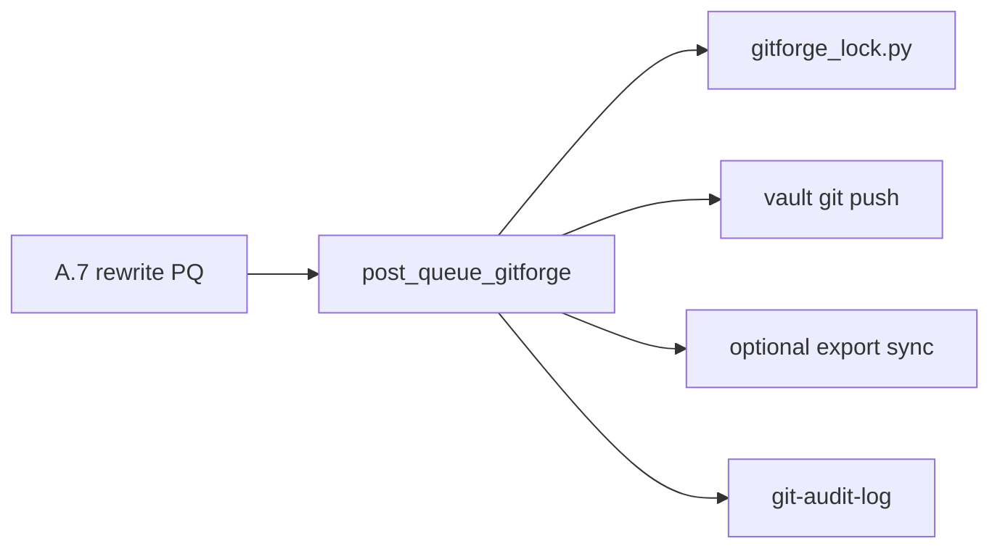
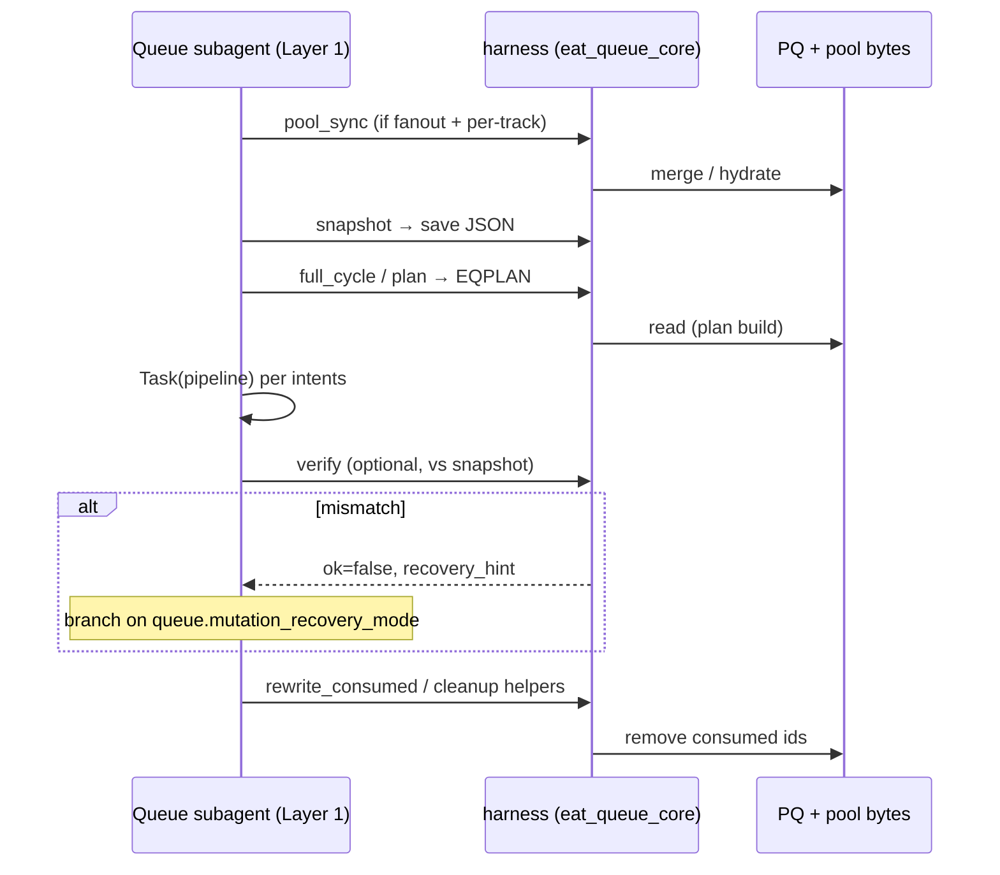

# Queue harness architecture

Normative **prompt queue (PQ)** and **central pool** file mutations for EAT-QUEUE go through **`scripts/eat_queue_core`** — invoked as **`python3 -m scripts.eat_queue_core.harness`** from the vault root with **`PYTHONPATH=.`**. The Queue subagent ([[.cursor/rules/agents/queue.mdc|queue.mdc]]) dispatches pipelines from **EQPLAN** (`eat_queue_run_plan.json` beside **PQ**); it does **not** invent dispatch order by re-reading raw **PQ** except where **queue.mdc** explicitly allows (e.g. empty **`intents`** → **A.1b** bootstrap).

## Subcommands (CLI)

| Subcommand | Role |
|------------|------|
| **`pool_sync`** | Hydrate per-track **PQ** from the central pool (dual-track; see [[3-Resources/Second-Brain/Docs/Dual-track-EAT-QUEUE-Operator|Dual-track-EAT-QUEUE-Operator]]) |
| **`snapshot`** | Emit JSON with **`sha256`** + **`line_count`** for **PQ** (and central pool when **`queue.central_pool_fanout_enabled`**) |
| **`verify`** | Compare current bytes to a prior **`snapshot`** JSON; exit **2** on mismatch |
| **`plan`** | Write **`eat_queue_run_plan.json`** (deterministic **`intents`**) |
| **`full_cycle`** | Reactive multi-pass plan + optional cleanup (**`run_full_eat_queue_cycle`**) |
| **`rewrite_consumed`** | Remove consumed ids (**A.7**); dual-pool when fanout + per-track **PQ** |
| **`append_entries`** | Validated JSONL append with **`max_midrun_jsonl_appends_per_eat_queue_run`** cap |
| **`post_queue_gitforge`** | Post–**A.7** lock, vault git, optional export sync, **git-audit-log** ([[.cursor/rules/agents/queue.mdc|queue.mdc]] **A.7a**); hand-off JSON via **`--handoff-file`** or **stdin** |

Common flags: **`--vault-root`**, **`--config`** (defaults to [[3-Resources/Second-Brain/Docs/Core/Second-Brain-Config|Second-Brain-Config]] path when present), **`--parallel-context-file`** / **`--parallel-context-yaml`** when **A.0x** resolves a per-track bundle.

## GitForge harness (`post_queue_gitforge`)

Deterministic post–**A.7** step (when **`gitforge.enabled`**, **`gitforge.harness_enabled`** (default **true**), and **`effective_pipeline_mode`** is **`balance`** or **`quality`**). **Not** an LLM **`Task`** — Layer 1 runs **`PYTHONPATH=. python3 -m scripts.eat_queue_core.harness post_queue_gitforge`** with **`--vault-root`**, **`--handoff-file`** (JSON matching [[.cursor/agents/gitforge.md|agents/gitforge.md]] hand-off), optional **`--parallel-context-file`**. **Stdout:** single JSON object; **exit 0** = success or policy skip (including lock held); **non-zero** = hard failure (**Proof-on-failure**, **`error_type: gitforge-harness-failure`**). Implementation: [[`scripts/eat_queue_core/post_queue_gitforge.py`](scripts/eat_queue_core/post_queue_gitforge.py)].

## Sequence (typical EAT-QUEUE)

## Mutation recovery vs harness validation

These are **orthogonal**:

- **`queue.mutation_recovery_mode`** (**`hard_stop`** \| **`restart_plan`** \| **`continue_best_effort`**, default **`restart_plan`**) governs **on-disk** **PQ** / pool drift when **`harness verify`** fails. **`recovery_hint`** in verify output tells Layer 1 whether to refuse rewrite, re-plan from disk, or continue with latest snapshot semantics.
- **`queue.harness_validation_mode`** (**`advisory`** \| **`strict`**) governs **pipeline `Task` return** attestation (**A.5i** — nested ledger, blocked scope). See [[3-Resources/Second-Brain/Docs/Harness-Patterns-and-Guidelines|Harness-Patterns-and-Guidelines]].

### Risk: `continue_best_effort`

Prefer default **`restart_plan`** while building trust. **`continue_best_effort`** can **mask same-lane races** if two chats append or rewrite the same lane’s **PQ** / **`lane_project_id`** without coordination — orthogonal to the “one active project per track” policy in the dual-track operator guide.

## Operator checklist (post-migration)

1. **Config:** Machine-readable **`queue:`** in [[3-Resources/Second-Brain/Docs/Core/Second-Brain-Config|Second-Brain-Config]] includes **`python_orchestrator_enabled: true`**, **`mutation_recovery_mode`**, **`harness_validation_mode`**, and (recommended) **`max_midrun_jsonl_appends_per_eat_queue_run`**.
2. **Pre-EAT-QUEUE:** From vault root, **`PYTHONPATH=. python3 -m scripts.eat_queue_core.harness full_cycle`** (or **`plan`**) so **EQPLAN** matches current **PQ** and lane — see [[3-Resources/Second-Brain/Docs/Python-Queue-Orchestrator|Python-Queue-Orchestrator]].
3. **Optional drift check:** **`harness snapshot`** → save JSON → after dispatch window → **`harness verify`**; on mismatch, follow **`recovery_hint`** (see **`mutation_recovery_mode`**).
4. **Gate script:** `python3 scripts/queue-gate-compute.py report` should not warn indefinitely on **`python_orchestrator_enabled`** once Config is aligned (stderr advisories for missing harness keys are expected on old forks until updated).

## Related

- [[3-Resources/Second-Brain/Docs/Python-Queue-Orchestrator|Python-Queue-Orchestrator]] — plan schema, **`queue_rewrite_ids`**
- [[.cursor/rules/agents/queue.mdc|queue.mdc]] **A.0.5**, **A.7**
- [[3-Resources/Second-Brain/Docs/Safety-Invariants|Safety-Invariants]] — single-writer discipline
