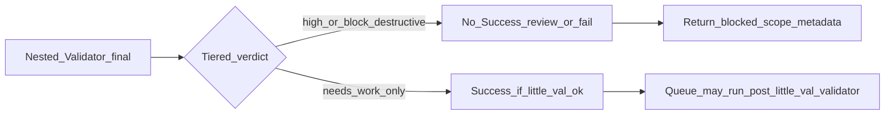

## Overview

This note defines the **indexed layer model** (L0–L2) and the **helper family** (Validator, Research, Internal Repair Agent) for automation in the vault. All "must" obligations are **conditional**: they apply only when the scenario specifies (e.g. Queue **must** run Research **only when** there is a research queue item being eaten). Pipeline (Layer 2) prompts are **explicit and conditional**, not run-without-purpose.

**See also:** [[3-Resources/Second-Brain/Subagent-Safety-Contract]], [[3-Resources/Second-Brain/Queue-Sources]], [[3-Resources/Second-Brain/Docs/Harness-Patterns-and-Guidelines|Harness-Patterns-and-Guidelines]], [[3-Resources/Second-Brain/Docs/Prompt-Craft-Subagent|Prompt-Craft-Subagent]], [[3-Resources/Second-Brain/Docs/Validator-Tiered-Blocks-Spec|Validator-Tiered-Blocks-Spec]], [[3-Resources/Second-Brain/Docs/Nested-Subagent-Ledger-Spec|Nested-Subagent-Ledger-Spec]], [[3-Resources/Second-Brain/Docs/Pipeline-Validator-Profiles|Pipeline-Validator-Profiles]], [[3-Resources/Second-Brain/Docs/Examples/Roadmap-Deepen-Dry-Run-Reference|Roadmap-Deepen-Dry-Run-Reference]] (illustrative EAT-QUEUE deepen trace; subordinate to queue/roadmap contracts), `.cursor/rules/agents/queue.mdc`, `.cursor/agents/*.md`

**Why three pipeline modes (`quality` / `balance` / `speed`)?** Routine **RESUME_ROADMAP** runs with pre-deepen research and nested validation could stretch toward very long wall-clock times; the bundled **validator profiles** trade depth on **Layer 1** post–little-val checks and **Layer 2** nested IRA/compare work against speed, while **hard** validator signals and **safety escalation** still force the full path. Defaults and thresholds live in [[3-Resources/Second-Brain-Config|Second-Brain-Config]] / [[3-Resources/Second-Brain/Parameters|Parameters]]; operator semantics and escape hatches are in [[3-Resources/Second-Brain/Docs/Pipeline-Validator-Profiles|Pipeline-Validator-Profiles]].

---

## Harness gates (MUST when scenario applies)

| Gate | Owner | Reference |
|------|--------|-----------|
| **A.5i** return parse (`nested_subagent_ledger`, **`blocked_scope`**, attestation) | Layer 1 | [[.cursor/rules/agents/queue.mdc|queue.mdc]] **A.5i**; [[3-Resources/Second-Brain/Docs/Harness-Patterns-and-Guidelines|Harness-Patterns-and-Guidelines]] §4 |
| **`nested_subagent_ledger` + conditional `blocked_scope`** on final return | Layer 2 pipelines | [[3-Resources/Second-Brain/Docs/Harness-Patterns-and-Guidelines|Harness-Patterns-and-Guidelines]] §2; [[3-Resources/Second-Brain/Docs/Nested-Subagent-Ledger-Spec|Nested-Subagent-Ledger-Spec]] |
| **TodoWrite** phase lifecycle | Layer 2 + helpers | § TodoWrite (below) |

Harness does **not** override § **Conditional obligation** — each **must** still keys off its scenario.

---

## Observability (nested ledgers)

- **Layer 2 — `nested_subagent_ledger`:** **All** queue-dispatched pipelines that use nested helpers (ingest, archive, organize, distill, express, research, roadmap) **must** return a verbose, ordered ledger of nested **`Task`** calls (Validator, IRA, Research), skill-only steps (little val), and contract skips, including **verbatim** `host_error_raw` when the host rejects `subagent_type` or returns `resource_exhausted` (sanitized per spec). Full schema: [[3-Resources/Second-Brain/Docs/Nested-Subagent-Ledger-Spec|Nested-Subagent-Ledger-Spec]]. The same object appears in the pipeline Run-Telemetry note body and as fenced YAML in the Task return (roadmap: before optional `prompt_craft_request` and final `queue_continuation`).
- **Layer 1 — `dispatch_ledger` (recommended):** The Queue subagent records each outbound **`Task`** it performs (pipeline, post–little-val validator, PromptCraft, bootstrap) so operators can tell **L1 never launched** vs **L2 nested failure**. See `queue.mdc` **(3c)** and the spec.
- **Watcher-Result:** EAT-QUEUE embeds **`nested_subagent_ledger`** YAML in **`trace`** for roadmap and **non-roadmap** pipelines when present (length cap + link to Run-Telemetry). Missing ledger on gated success → **Errors.md** `nested_ledger_missing_or_unparseable` (roadmap v1 soft gate; other pipelines analogous when **`queue.strict_nested_ledger_all_pipelines`** is **true**). See `queue.mdc` **A.6**; **A.5i** adds **`harness_outcome`** / **`blocked_scope`** echo when applicable.
- **Continuation log:** When strict nested attestation fails, Layer 1 may append **`.technical/queue-continuation.jsonl`** with **`suppress_reason: nested_attestation_failure`** (not bootstrap-eligible). See [[3-Resources/Second-Brain/Docs/Queue-Continuation-Spec|Queue-Continuation-Spec]] and Second-Brain-Config § **`queue`**.

---

## Conditional obligation (all layers)

Every **must** is tied to a scenario:

- **Queue (Layer 1):** Must run ResearchSubagent **only when** the current queue entry has mode RESEARCH-AGENT or RESEARCH-GAPS. Must run ValidatorSubagent **only when** the current queue entry has mode VALIDATE or ROADMAP_HANDOFF_VALIDATE. Must run a Layer 2 pipeline **only when** the entry is a pipeline mode (INGEST_MODE, ARCHIVE MODE, etc.). May run **PromptCraftSubagent** (`Task(prompt_craft)`) **only when** [[3-Resources/Second-Brain-Config|Second-Brain-Config]] `recovery_auto_craft_enabled` is true **and** a pipeline return contains **`prompt_craft_request`** per [[3-Resources/Second-Brain/Subagent-Safety-Contract|Subagent-Safety-Contract]] — see [[.cursor/rules/agents/queue.mdc|queue.mdc]] **A.5d**.
- **Pipelines (Layer 2):** Must call little-val, IRA, or Validator **only when** the contract for that run/step specifies (e.g. when little val returns ok:true, must call Validator; when little val remains ok:false after attempts, must call IRA; nested Validator→IRA→second pass follows **`effective_profile_snapshot.nested_ira_policy`** from the Layer 1 hand-off when present — **`always`**, **`clean_skip`**, or **`medium_or_higher`** per [[3-Resources/Second-Brain/Docs/Pipeline-Validator-Profiles|Pipeline-Validator-Profiles]]). Be **explicit** about when each helper runs; do **not** run helpers without purpose.
- **Layer 2 exception in tone:** Pipeline prompts are **explicit and conditional**, not unconditionally forceful. Use "must" when the condition holds; do not imply that helpers run on every run regardless of context.

---

## Indexed layers (hard layering for pipelines)

| Layer | Role | Calls | Never does |
|-------|------|-------|------------|
| **Layer 0** | Cursor chat (user-facing) | **Must** call Layer 1 only when user triggers EAT-QUEUE, PROCESS TASK QUEUE, or a direct mode. | Never calls pipelines or helpers directly. |
| **Layer 1** | Queue / Dispatcher | For each queue entry: **must** call the matching Layer 2 pipeline via Task **when** the entry is a pipeline mode; **must** run ResearchSubagent **only when** the entry has mode RESEARCH-AGENT or RESEARCH-GAPS; **must** run ValidatorSubagent **only when** the entry has mode VALIDATE or ROADMAP_HANDOFF_VALIDATE; **may** run PromptCraftSubagent per Config + **A.5d** after a pipeline return with **`prompt_craft_request`**; **must** run **`harness post_queue_gitforge`** once after prompt-queue **A.7** per **queue.mdc A.7a** when **`gitforge.enabled`**, **`gitforge.harness_enabled`** (default **true**), and **`effective_pipeline_mode`** is **`balance`** or **`quality`** (skipped for **`speed`**) — **subprocess**, not **`Task`**; legacy **`Task(gitforge)`** only when **`harness_enabled`** is **false**. | Never inlines pipeline or helper logic; never calls Layer 2 as nested agents. |
| **Layer 2** | Pipeline executors (Ingest, Archive, Organize, Distill, Express, Roadmap, Research when queue-dispatched) | **When** the contract requires: **must** run little-val (skill) for CODE pipelines; **when** little val remains ok:false after attempts, **must** run IRA; **when** little val returns ok:true (or Research has synthesis), **must** run ValidatorSubagent; nested IRA/compare per **`nested_ira_policy`** in **`effective_profile_snapshot`** (hand-off from **A.4z**) or legacy Config. Roadmap **must** run ResearchSubagent when pre-deepen research is enabled. | Never read or write queue files, Watcher-Result, or Decision Wrappers; destructive work only after backup + snapshot + confidence gates. |

---

## Helper family (no strict layer index)

**Validator, Research, Internal Repair Agent**, and **PromptCraft** (recovery-only) are **helper subagents**. The Queue **must** dispatch Validator / Research when the scenario requires; Layer-2 pipelines **must** call Validator and IRA per the nested-validator cycle (including **IRA after first validator pass** when `ira_after_first_pass` is effective true). **PromptCraft** is invoked **only** by **Layer 0** (manual) or **Layer 1** (Config-gated **A.5d**), never by IRA or Validator.

- **Must be invoked** (not reimplemented) **only when** the contract specifies—e.g. when little val returns ok:true for the run, the pipeline **must** call ValidatorSubagent with the appropriate validation_type, then IRA + second validator when policy requires; when the Queue is eating a RESEARCH-AGENT or RESEARCH-GAPS entry, it **must** run ResearchSubagent (which runs the research_synthesis validator + IRA cycle when synthesis exists); when the entry is VALIDATE or ROADMAP_HANDOFF_VALIDATE, it **must** run ValidatorSubagent.
- Helpers are read-only on caller-owned artifacts (except writing their own report/telemetry notes).
- They never read or write queue files, Watcher-Result, or Decision Wrappers unless explicitly scoped in the contract.
- **Internal Repair Agent:** Emits `suggested_fixes` tagged with `risk_level` (`low` / `medium` / `high`). The **caller pipeline** applies those fixes at **any** level when global core guardrails and pipeline-specific gates pass; `risk_level` means blast radius and preferred apply order, not “human-only.” Skips are per-fix when gates fail. See [[3-Resources/Second-Brain/Subagent-Safety-Contract|Subagent-Safety-Contract]] (Internal Repair Agent exception).

**Research** in particular:

- **Must** be run by Layer 1 (Queue) **only when** there is a RESEARCH-AGENT or RESEARCH-GAPS queue item being eaten.
- **Must** be run by Layer 2 (Roadmap) **only when** pre-deepen research is enabled for that RESUME_ROADMAP run.
- When Research produces synthesized notes, the caller (Queue or Roadmap) is responsible for any downstream validation (e.g. calling ValidatorSubagent with research_synthesis) per contract; Research does not decide Success for the overall run.

---

## Success gates

- **Little val:** No pipeline may return Success if the final little val verdict for that run is `ok: false`.
- **Validator (when nested):** Pipelines must honor validator **final-pass** severity / `recommended_action` before returning Success. **`severity: high`** or **`recommended_action: block_destructive`** → **do not** claim Success. **`recommended_action: needs_work`** (without high / block_destructive) → **Success allowed** when little val is ok and contract allows (tiered blocks). See [[3-Resources/Second-Brain/Docs/Validator-Tiered-Blocks-Spec|Validator-Tiered-Blocks-Spec]] §3.

### Tiered outcome → pivot (conceptual)

Layer 1 may **append repair-first** lines (`recal`, `handoff-audit`, …) after post–little-val when hard block; it **never** calls IRA. Repair-first sort: same `project_id`, repair before deepen — see Validator-Tiered-Blocks-Spec §5 and Queue-Sources.

---

## TodoWrite requirement

Every pipeline and helper subagent prompt **must** include a callout to use **TodoWrite** for run-scoped phase todos: create phases, set `in_progress` / `completed` / `cancelled`, and **must not** return Success while any todo for that run is `pending` or `in_progress`.
